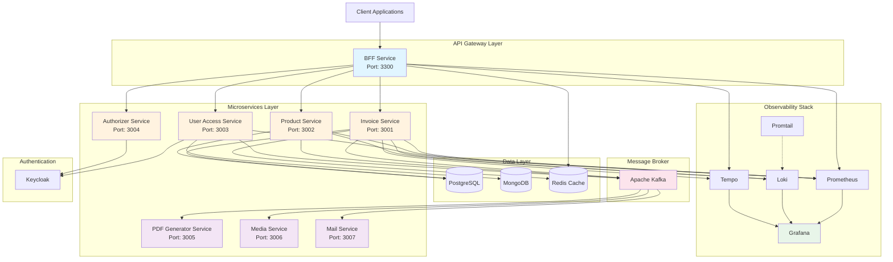

# 🚀 Khóa Học NestJS Microservices Thực Chiến: Từ Zero Đến Hero


---

## 📋 Tổng Quan Khóa Học

Chào mừng bạn đến với **khóa học thực chiến** về xây dựng hệ thống **Microservices** quy mô doanh nghiệp sử dụng **NestJS**. Đây không phải là một khóa học lý thuyết suông, mà là một hành trình thực chiến từ A-Z, giúp bạn nắm vững mọi khía cạnh của kiến trúc Microservices hiện đại.

### 🎯 Mục Tiêu Khóa Học

Khóa học này được thiết kế để biến bạn từ một **người mới bắt đầu** thành một **chuyên gia Microservices**, với khả năng:

- ✅ **Thiết kế** và **triển khai** hệ thống Microservices quy mô production
- ✅ **Xử lý** các vấn đề phức tạp về distributed systems
- ✅ **Monitoring**, **tracing**, và **logging** trong môi trường phân tán
- ✅ **Deploy** và **scale** ứng dụng trên môi trường cloud/VPS
- ✅ **Áp dụng** các design patterns và best practices trong thực tế

---

## 🏗️ Kiến Trúc Hệ Thống E-Invoice

Dự án thực chiến của chúng ta là một **hệ thống quản lý hóa đơn điện tử** (E-Invoice) với kiến trúc Microservices hoàn chỉnh.

### 🔷 Sơ Đồ Tổng Quan



### 🎯 Các Microservices Chính

#### 1️⃣ **BFF (Backend For Frontend)**

- **Vai trò**: API Gateway, điểm truy cập duy nhất cho client
- **Port**: 3300
- **Đặc điểm**:
  - REST API với Swagger documentation
  - Authentication & Authorization với Keycloak
  - Rate limiting với Redis
  - Global exception handling
  - Request/Response logging

#### 2️⃣ **Invoice Service**

- **Vai trò**: Quản lý hóa đơn điện tử
- **Port**: 3001 (HTTP), 3201 (TCP)
- **Đặc điểm**:
  - CRUD operations cho invoices
  - Integration với Payment gateway (Stripe)
  - Event-driven architecture với Kafka
  - PostgreSQL cho data persistence
  - Distributed tracing với OpenTelemetry

#### 3️⃣ **Product Service**

- **Vai trò**: Quản lý sản phẩm/dịch vụ
- **Port**: 3002 (HTTP), 3202 (TCP)
- **Đặc điểm**:
  - Product catalog management
  - Inventory tracking
  - PostgreSQL database
  - Integration tests với Testcontainers

#### 4️⃣ **User Access Service**

- **Vai trò**: Quản lý người dùng và phân quyền
- **Port**: 3003 (HTTP), 3203 (TCP)
- **Đặc điểm**:
  - Hỗ trợ cả TCP và gRPC protocols
  - Integration với Keycloak
  - MongoDB cho user data
  - Role-based access control (RBAC)

#### 5️⃣ **Authorizer Service**

- **Vai trò**: Xác thực và phân quyền tập trung
- **Port**: 3004 (HTTP), 3204 (TCP)
- **Đặc điểm**:
  - JWT validation
  - Permission checking
  - Keycloak integration
  - Token caching với Redis

#### 6️⃣ **PDF Generator Service**

- **Vai trò**: Tạo PDF cho hóa đơn
- **Port**: 3005 (HTTP), 3205 (TCP)
- **Đặc điểm**:
  - Event-driven design
  - Puppeteer cho PDF generation
  - Template rendering với EJS
  - Asynchronous processing

#### 7️⃣ **Media Service**

- **Vai trò**: Quản lý upload/download file và hình ảnh
- **Port**: 3006 (HTTP), 3206 (TCP)
- **Đặc điểm**:
  - Cloudinary integration
  - Image optimization
  - File storage management
  - Event publishing

#### 8️⃣ **Mail Service**

- **Vai trò**: Gửi email notification
- **Port**: 3007 (HTTP)
- **Đặc điểm**:
  - SMTP integration (Gmail)
  - Template-based emails
  - Event-driven notifications
  - Queue-based processing

---

## 🛠️ Tech Stack Toàn Diện

### 🔥 Backend Framework

- **NestJS 11.x**: Framework chính cho microservices
- **TypeScript 5.8**: Type-safe development
- **Node.js 18+**: Runtime environment
- **Express 5**: HTTP server

### 🗄️ Databases

- **PostgreSQL**: Relational database cho Invoice, Product
- **MongoDB**: NoSQL database cho User Access
- **Redis**: Caching layer và rate limiting
- **TypeORM**: ORM cho PostgreSQL
- **Mongoose**: ODM cho MongoDB

### 📨 Message Broker & Communication

- **Apache Kafka**: Event streaming platform
- **TCP**: Inter-service communication
- **gRPC**: High-performance RPC
- **@grpc/grpc-js**: gRPC implementation
- **KafkaJS**: Kafka client

### 🔐 Authentication & Authorization

- **Keycloak 25.0**: Identity & Access Management
- **JWT**: Token-based authentication
- **jwks-rsa**: Key verification
- **jsonwebtoken**: JWT handling

### 📊 Observability Stack

- **Grafana 10.2**: Visualization & dashboards
- **Prometheus 3.8**: Metrics collection
- **Loki 2.9**: Log aggregation
- **Tempo**: Distributed tracing backend
- **Promtail 2.9**: Log shipping
- **OpenTelemetry**: Instrumentation framework
  - `@opentelemetry/api`
  - `@opentelemetry/sdk-trace-node`
  - `@opentelemetry/auto-instrumentations-node`
  - `@opentelemetry/exporter-trace-otlp-proto`
- **Pino**: Structured logging
  - `nestjs-pino`
  - `pino-http`
  - `pino-loki`
  - `pino-pretty`

### 🐳 DevOps & Infrastructure

- **Docker**: Containerization
- **Docker Compose**: Multi-container orchestration
- **NX 21.4**: Monorepo management
- **GitHub Actions**: CI/CD pipeline
- **Testcontainers**: Integration testing

### 🔧 Utilities & Tools

- **Puppeteer**: PDF generation
- **Cloudinary**: Image storage & optimization
- **Nodemailer**: Email sending
- **Stripe**: Payment processing
- **EJS**: Template engine
- **Class Validator**: DTO validation
- **Class Transformer**: Object transformation

### 🧪 Testing

- **Jest 30**: Testing framework
- **@nestjs/testing**: NestJS testing utilities
- **Testcontainers**: PostgreSQL integration tests
- **Supertest** (implied): E2E testing

### 📦 Monorepo & Build Tools

- **NX Workspace**: Monorepo architecture
- **pnpm**: Package manager
- **Webpack**: Bundler
- **ESLint**: Linting
- **Prettier**: Code formatting
- **Husky**: Git hooks
- **Commitlint**: Commit message linting
- **lint-staged**: Pre-commit linting

---

## 💡 Điểm Nổi Bật Của Khóa Học

### ✨ 1. Production-Ready Architecture

Hệ thống được thiết kế với **9 microservices** độc lập, hoàn toàn có thể **deploy lên production** ngay lập tức.

### ✨ 2. Observability Toàn Diện

Triển khai **đầy đủ 3 pillars** của Observability:

- **Logging**: Loki + Promtail + Pino
- **Metrics**: Prometheus + prom-client
- **Tracing**: Tempo + OpenTelemetry

### ✨ 3. Event-Driven Design

Sử dụng **Apache Kafka** cho asynchronous communication, đảm bảo:

- Loose coupling giữa các services
- High throughput
- Fault tolerance
- Scalability

### ✨ 4. Saga Pattern Implementation

Xử lý **distributed transactions** phức tạp với:

- Saga Orchestration
- Compensation logic
- State management
- Error recovery

### ✨ 5. Multiple Communication Protocols

Học cách sử dụng:

- **REST API** cho external clients
- **TCP** cho internal sync communication
- **gRPC** cho high-performance RPC
- **Kafka** cho async events

### ✨ 6. Enterprise Authentication

Integration với **Keycloak** cho:

- Single Sign-On (SSO)
- OAuth2/OIDC
- Role & Permission management
- Multi-tenant support

### ✨ 7. Comprehensive Testing

Các loại testing được cover:

- **Unit Tests** với Jest
- **Integration Tests** với Testcontainers
- **E2E Tests**
- **Contract Tests**

### ✨ 8. DevOps Best Practices

- **Docker Compose** cho local development
- **GitHub Actions** cho CI/CD
- **Environment-based** configuration
- **Health checks** & monitoring

### ✨ 9. Monorepo Management

Sử dụng **NX Workspace** để:

- Share code giữa các services
- Consistent tooling
- Dependency graph visualization
- Incremental builds

### ✨ 10. Real-World Use Cases

Tích hợp các services thực tế:

- **Stripe** payment
- **Cloudinary** media storage
- **Gmail** SMTP
- **Puppeteer** PDF generation

---

## 🎖️ Kết Quả Sau Khóa Học

Sau khi hoàn thành khóa học, bạn sẽ có khả năng:

### 🏆 Technical Skills

- ✅ Thiết kế và triển khai **Microservices Architecture** quy mô enterprise
- ✅ Xây dựng **RESTful APIs** và **gRPC services** với NestJS
- ✅ Implement **Event-Driven Architecture** với Kafka
- ✅ Xử lý **Distributed Transactions** với Saga Pattern
- ✅ Setup **Observability Stack** hoàn chỉnh (Logging, Metrics, Tracing)
- ✅ Implement **Authentication & Authorization** với Keycloak
- ✅ Viết **comprehensive tests** (Unit, Integration, E2E)
- ✅ **Containerize** và **orchestrate** microservices với Docker
- ✅ Setup **CI/CD pipeline** với GitHub Actions
- ✅ **Deploy** lên VPS/Cloud

### 🎯 Architectural Understanding

- ✅ Hiểu rõ **trade-offs** giữa Monolith và Microservices
- ✅ Nắm vững các **design patterns** (Saga, CQRS, Event Sourcing, etc.)
- ✅ Áp dụng **CAP theorem** và **consistency patterns**
- ✅ Thiết kế **resilient systems** với Circuit Breaker, Retry, Timeout
- ✅ Implement **API Gateway pattern**

### 💼 Career Benefits

- ✅ Có một **portfolio project** ấn tượng để showcase
- ✅ Resume **stand out** với microservices experience
- ✅ Sẵn sàng cho **senior/lead** positions
- ✅ Kiến thức apply trực tiếp vào **production systems**

---

## 🎯 Đối Tượng Học Viên

### ✅ Phù Hợp Với

- 👨‍💻 Backend developers muốn chuyển sang Microservices
- 🎓 Sinh viên/Fresh graduates muốn học kiến thức thực chiến
- 👔 Developers muốn ứng tuyển vị trí Senior/Lead
- 🚀 Lập trình viên muốn nâng cấp technical skills
- 🏢 Technical leads cần thiết kế hệ thống quy mô lớn

### 📋 Yêu Cầu Trước Khóa Học

- 📌 Có kinh nghiệm với **JavaScript/TypeScript**
- 📌 Hiểu biết cơ bản về **Node.js** và **Express**
- 📌 Biết về **REST API** và **HTTP protocol**
- 📌 Có kiến thức về **SQL/NoSQL databases**
- 📌 (Tốt hơn) Đã từng làm việc với **NestJS** hoặc **Angular**
- 📌 (Tốt hơn) Hiểu biết về **Docker** basics

---
## 📌 Tương tác với Giảng viên

Khóa học không chỉ dừng lại ở video lý thuyết – bạn sẽ luôn có **sự đồng hành trực tiếp từ giảng viên** trong suốt quá trình học.

### 💬 Hỏi – Đáp nhanh chóng

- Đặt câu hỏi trực tiếp bên dưới mỗi bài học hoặc trong mục Q&A.
- Nhận phản hồi nhanh chóng và giải thích rõ ràng từ khái niệm cơ bản đến kỹ thuật nâng cao.

### 🛠 Hỗ trợ xử lý lỗi

- Mô tả vấn đề và đính kèm code khi gặp lỗi.
- Giảng viên sẽ hướng dẫn từng bước để khắc phục và giải thích nguyên nhân.

### 🤝 Trao đổi cùng cộng đồng học viên

- Tham gia **group riêng** để thảo luận, chia sẻ kinh nghiệm và học hỏi lẫn nhau.
- Kết nối với các học viên khác đang làm trong ngành.

### 🌐 Liên hệ & Kết nối

Nếu bạn cần hỗ trợ hoặc muốn kết nối thêm ngoài khóa học, có thể liên hệ qua:

- 📧 **Email:** [dotanthanhvlog@gmail.com](mailto:dotanthanhvlog@gmail.com)
- 💼 **LinkedIn:** [https://www.linkedin.com/in/thanh270600/](https://www.linkedin.com/in/thanh270600/)
- 🐙 **GitHub:** [https://github.com/thanhmati](https://github.com/thanhmati)
- 📺 **YouTube:** [https://www.youtube.com/@laptrinhfullstack](https://www.youtube.com/@laptrinhfullstack)
- 💬 **Facebook Group:** [https://www.facebook.com/groups/ltfullstack](https://www.facebook.com/groups/ltfullstack)
- 📞 **Zalo** 0762216048

---

## 📂 Cấu Trúc Dự Án

```
einvoice-tutorial/
│
├── apps/                          # Các microservices
│   ├── bff/                       # API Gateway (REST)
│   ├── invoice/                   # Invoice Service (TCP)
│   ├── product/                   # Product Service (TCP)
│   ├── user-access/              # User Service (TCP + gRPC)
│   ├── authorizer/               # Auth Service (TCP)
│   ├── pdf-generator/            # PDF Service (TCP)
│   ├── media/                     # Media Service (TCP)
│   ├── mail/                      # Mail Service
│   └── einvoice-e2e/             # E2E Tests
│
├── libs/                          # Shared libraries
│   ├── configuration/             # Config management
│   ├── constants/                 # Constants & enums
│   ├── decorators/                # Custom decorators
│   ├── entities/                  # Shared entities
│   ├── guards/                    # AuthN/AuthZ guards
│   ├── interceptors/              # Request/Response interceptors
│   ├── interfaces/                # Shared interfaces & DTOs
│   ├── kafka/                     # Kafka utilities
│   ├── middlewares/               # Middleware
│   ├── observability/             # Logging, Metrics, Tracing
│   │   ├── logger/               # Pino logging
│   │   ├── metrics/              # Prometheus metrics
│   │   └── tracing/              # OpenTelemetry tracing
│   ├── saga-orchestration/        # Saga pattern implementation
│   ├── schemas/                   # MongoDB schemas
│   └── utils/                     # Utility functions
│
├── docker/                        # Docker configurations
│   ├── prometheus.yml            # Prometheus config
│   ├── promtail-config.yaml      # Promtail config
│   └── tempo.yaml                # Tempo config
│
├── tools/                         # Build & deployment scripts
│   └── local/                    # Local development tools
│
├── lessons/                       # Course materials
│
├── docker-compose.provider.yaml   # Infrastructure services
├── nx.json                        # NX configuration
├── package.json                   # Dependencies
└── tsconfig.base.json            # TypeScript config
```

---

## 🚀 Quick Start

### 1️⃣ Clone Repository

```bash
git clone <repository-url>
cd einvoice-tutorial
```

### 2️⃣ Install Dependencies

```bash
pnpm install
```

### 3️⃣ Start Infrastructure

```bash
pnpm docker:start:provider
```

Khởi động:

- MongoDB (Port: 27017)
- PostgreSQL (Port: 5432)
- Redis (Port: 6379)
- Kafka (Port: 9092, 29092)
- Keycloak (Port: 8180)
- Grafana (Port: 3000)
- Prometheus (Port: 9090)
- Loki (Port: 3100)
- Tempo (Port: 3200, 4317, 4318)

### 4️⃣ Start All Microservices

```bash
pnpm dev
```

### 5️⃣ Access Services

- **BFF API**: http://localhost:3300/api/v1
- **Swagger Docs**: http://localhost:3300/api/v1/docs
- **Grafana**: http://localhost:3000 (admin/admin)
- **Prometheus**: http://localhost:9090
- **Keycloak**: http://localhost:8180 (admin/admin)

---

## 📊 Monitoring & Observability URLs

| Service              | URL                   | Credentials             |
| -------------------- | --------------------- | ----------------------- |
| 📈 **Grafana**       | http://localhost:3000 | admin / admin           |
| 🔥 **Prometheus**    | http://localhost:9090 | -                       |
| 🔐 **Keycloak**      | http://localhost:8180 | admin / admin           |
| 🗄️ **pgAdmin**       | http://localhost:5050 | admin@admin.com / admin |
| 🔴 **Redis Insight** | http://localhost:5540 | -                       |

---

## 🔗 Các Endpoints Chính

### BFF Service (Port 3300)

```
GET    /api/v1/docs              # Swagger Documentation
GET    /api/v1/health            # Health Check
POST   /api/v1/auth/login        # Login
GET    /api/v1/invoices          # List invoices
POST   /api/v1/invoices          # Create invoice
GET    /api/v1/products          # List products
POST   /api/v1/products          # Create product
GET    /api/v1/users             # List users
POST   /api/v1/users             # Create user
```

---

## 🎨 Best Practices Được Áp Dụng

### ✅ Architecture Patterns

- **BFF (Backend for Frontend)**: Tách biệt API Gateway
- **CQRS**: Separate read/write operations
- **Event Sourcing**: Event-driven state management
- **Saga Pattern**: Distributed transaction management
- **Repository Pattern**: Data access abstraction

### ✅ Code Quality

- **TypeScript Strict Mode**: Type safety
- **ESLint**: Code linting
- **Prettier**: Code formatting
- **Husky**: Git hooks
- **Commitlint**: Conventional commits

### ✅ Security

- **JWT Authentication**: Token-based auth
- **Role-Based Access Control**: Permission system
- **Rate Limiting**: API throttling
- **Input Validation**: DTO validation
- **Environment Variables**: Sensitive data protection

### ✅ Performance

- **Redis Caching**: Response caching
- **Connection Pooling**: Database optimization
- **Lazy Loading**: Module optimization
- **Event-Driven**: Async processing
- **Compression**: Response compression (implied)

### ✅ Reliability

- **Health Checks**: Service monitoring
- **Circuit Breaker**: Fault tolerance (via Saga)
- **Retry Mechanisms**: Error recovery
- **Graceful Shutdown**: Clean termination
- **Idempotency**: Safe retries

---

## 📖 Tài Liệu & Resources

### 📚 Documentation

- [NestJS Official Docs](https://docs.nestjs.com/)
- [NX Workspace Docs](https://nx.dev/)
- [Microservices Patterns](https://microservices.io/patterns/)
- [OpenTelemetry Docs](https://opentelemetry.io/docs/)
- [Kafka Documentation](https://kafka.apache.org/documentation/)

### 🎥 Video Tutorials

- Coming soon...

### 💬 Community Support

- Discord Channel (TBA)
- Q&A Forum (TBA)

---

## 🤝 Đóng Góp & Hỗ Trợ

Nếu bạn gặp vấn đề hoặc có câu hỏi:

1. 📧 Email: [dotanthanhvlog@gmail.com]
2. 💬 Discord: [discord]
3. 📝 GitHub Issues: [https://github.com/thanhmati/einvoice-backend/issues]

---

## 📜 License

MIT License - Chi tiết xem file `LICENSE`

---

## 👨‍💻 Tác Giả

**Đỗ Tấn Thành**

- 🌐 Website: [https://laptrinhfullstack.vercel.app/]
- 📧 Email: [dotanthanhvlog@gmail.com]
- 💼 LinkedIn: [https://www.linkedin.com/in/thanh270600/]
- 🐙 GitHub: [https://github.com/thanhmati]

---

## 🌟 Special Thanks

Cảm ơn các công nghệ và cộng đồng open-source đã làm cho khóa học này có thể thực hiện được:

- NestJS Team
- NX Team
- Apache Kafka
- Grafana Labs
- OpenTelemetry Community

---

<div align="center">

### 🚀 Sẵn Sàng Bắt Đầu Hành Trình?

**Hãy clone repository và bắt đầu học ngay hôm nay!**

Made with ❤️ by Đỗ Tấn Thành

</div>
# einvoice_micro
