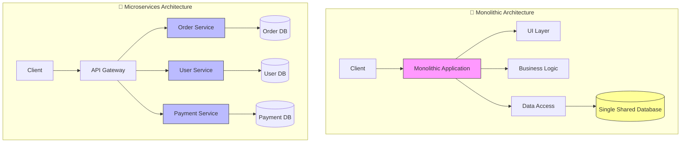

# 1. Microservice là gì? Khi nào KHÔNG nên dùng?

Microservices đang là "trend", nhưng nó cũng là con dao hai lưỡi. Bài học này sẽ giúp bạn hiểu rõ bản chất của Microservices và **quan trọng hơn là khi nào NÊN TRÁNH NÓ**.

---

## 🏗️ 1. Microservice là gì?

Microservices (Kiến trúc Vi dịch vụ) là một phương pháp thiết kế phần mềm, trong đó ứng dụng được chia tách thành **những dịch vụ nhỏ, độc lập**, chạy trong các process riêng biệt và giao tiếp với nhau thông qua các cơ chế nhẹ (thường là HTTP API hoặc Message Queue).

### 🌟 Đặc điểm cốt lõi:

1.  **Tính độc lập (Autonomy):** Mỗi service có thể được phát triển, deploy, và scale bởi một team riêng biệt mà không cần đợi team khác.
2.  **Database riêng biệt (Decentralized Data Management):** Mỗi service sở hữu database riêng. Service A không bao giờ được truy cập trực tiếp vào DB của Service B.
3.  **Tính chuyên biệt (Single Responsibility):** Mỗi service giải quyết một bài toán nghiệp vụ cụ thể (VD: Service Thanh toán chỉ lo thanh toán).
4.  **Đa dạng công nghệ (Polyglot):** Service A viết bằng NodeJS, Service B viết bằng Java, Service C viết bằng Go... đều được.

### 🖼️ Minh họa: Monolith vs Microservices

---

## 🚫 2. Khi nào KHÔNG nên dùng Microservices?

Đừng dùng Microservices chỉ vì Netflix hay Google dùng nó. **"You are not Google"**.
Dưới đây là những trường hợp bạn nên **tránh xa** Microservices và chọn Monolith (hoặc Modular Monolith):

### a. Khi bạn là Startup hoặc đang làm MVP (Minimum Viable Product)

- **Lý do:** Mục tiêu của Startup là **tốc độ** (đưa sản phẩm ra thị trường nhanh nhất) và **sự linh hoạt** (thay đổi nghiệp vụ liên tục để tìm Product-Market Fit).
- **Vấn đề của Microservices:** Việc setup hạ tầng, CI/CD, giao tiếp giữa các service tốn rất nhiều thời gian ban đầu. Khi nghiệp vụ thay đổi, bạn phải sửa code ở nhiều service, sửa contract (API), rất mệt mỏi.
- **Lời khuyên:** Dùng Monolith để code nhanh, deploy nhanh.

### b. Khi Team của bạn quá nhỏ (Dưới 10 người)

- **Quy tắc:** Nếu team của bạn không đủ người để chia thành các "Two-pizza teams" (mỗi team phụ trách trọn vẹn 1 service), thì đừng chia service.
- **Vấn đề:** Microservices đòi hỏi overhead về vận hành (Ops) rất lớn. Team nhỏ sẽ bị overload vì vừa phải code tính năng, vừa phải lo cấu hình Kubernetes, Service Mesh, Tracing, Logging...
- **Lời khuyên:** Team nhỏ nên tập trung vào code logic trên 1 repo duy nhất.

### c. Khi Domain nghiệp vụ chưa rõ ràng

- **Lý do:** Để chia tách service đúng, bạn phải hiểu cực rõ về **Bounded Context** (Ranh giới nghiệp vụ).
- **Vấn đề:** Nếu bạn chia service sai ngay từ đầu (VD: Cần 1 service User hay tách thành User + Profile + Auth?), việc gộp lại (Refactoring) khó hơn gấp 10 lần việc tách ra từ Monolith.
- **Lời khuyên:** Code Monolith trước để hiểu rõ luồng dữ liệu, sau đó tách dần (Strangler Fig Pattern).

### d. Khi ứng dụng đơn giản (CRUD)

- **Lý do:** Nếu ứng dụng chỉ là "Thêm, Sửa, Xóa" dữ liệu đơn giản, không có logic phức tạp.
- **Vấn đề:** Gọi API qua mạng chậm hơn gọi hàm nội bộ. Việc xử lý Distributed Transaction (Saga) cho một app CRUD là "lấy dao mổ trâu giết gà".

### e. Khi chưa có văn hóa & năng lực DevOps

- **Lý do:** Microservices đẻ ra hàng chục, hàng trăm service nhỏ.
- **Yêu cầu:** Bạn MẮT BUỘC phải có Automation Testing, Automation Deployment, Monitoring, Centralized Logging.
- **Lời khuyên:** Nếu team vẫn còn deploy thủ công (copy paste code lên server) hoặc chưa biết Docker/K8s là gì -> **QUAY XE NGAY LẬP TỨC**.

---

## ⚖️ 3. Bảng so sánh quyết định

| Tiêu chí                | ✅ Chọn Monolith khi...             | ✅ Chọn Microservices khi...                    |
| :---------------------- | :---------------------------------- | :---------------------------------------------- |
| **Quy mô Team**         | Nhỏ (< 10-20 người)                 | Lớn (Nhiều team độc lập)                        |
| **Độ hiểu biết Domain** | Mơ hồ, hay thay đổi                 | Rõ ràng, ổn định                                |
| **Ưu tiên số 1**        | Time-to-market (Ra mắt nhanh)       | Scalability (Khả năng mở rộng)                  |
| **Hiệu năng**           | Cần độ trễ cực thấp (Low latency)   | Chấp nhận độ trễ mạng để đổi lấy scale          |
| **Hạ tầng**             | Server đơn giản, ít chi phí         | Hệ thống Cloud/K8s phức tạp                     |
| **Dữ liệu**             | Nhất quán mạnh (Strong consistency) | Chấp nhận nhất quán cuối (Eventual consistency) |

---

## 🌟 Kết luận: Chiến lược "Monolith First"

Hầu hết các chuyên gia (Martin Fowler, Sam Newman) đều khuyên:

> **"Don't start with Microservices. Start with a Modular Monolith."**

Hãy xây dựng một khối Monolith nhưng được tổ chức code tốt (chia module rõ ràng). Khi hệ thống lớn lên và một module nào đó bắt đầu gây đau đớn (ví dụ: module Report ngốn hết RAM của server), lúc đó hãy tách module đó ra thành Microservice riêng lẻ.
