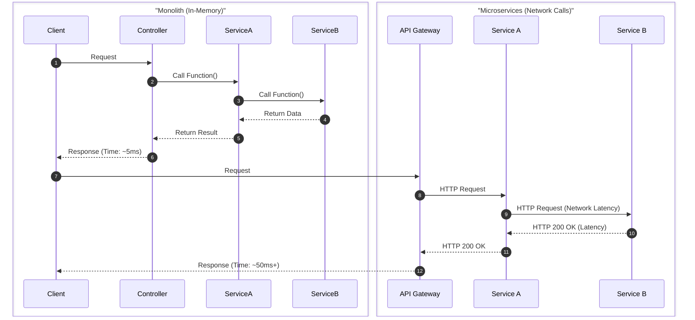
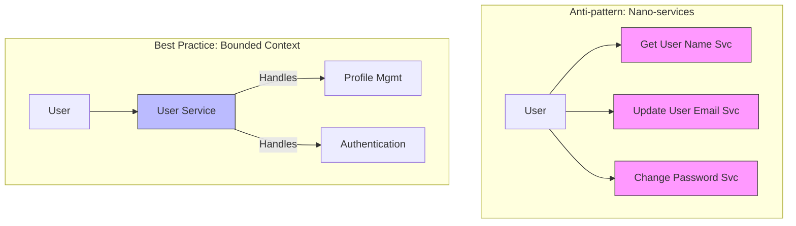
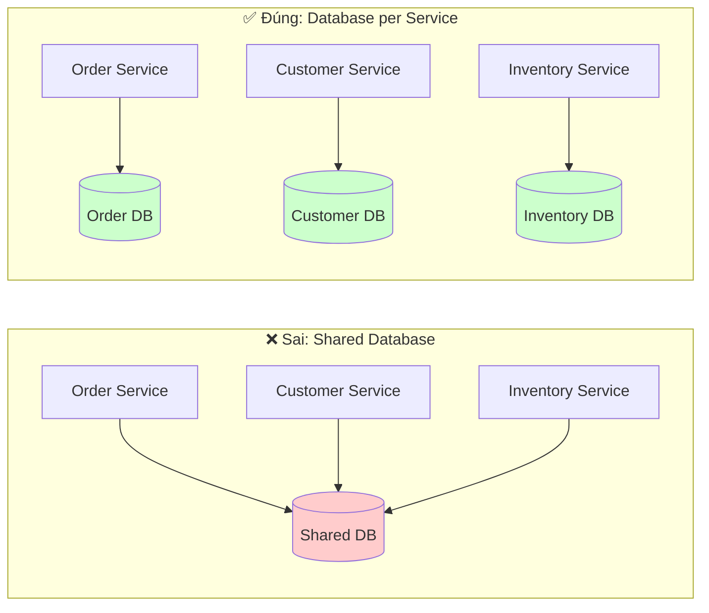
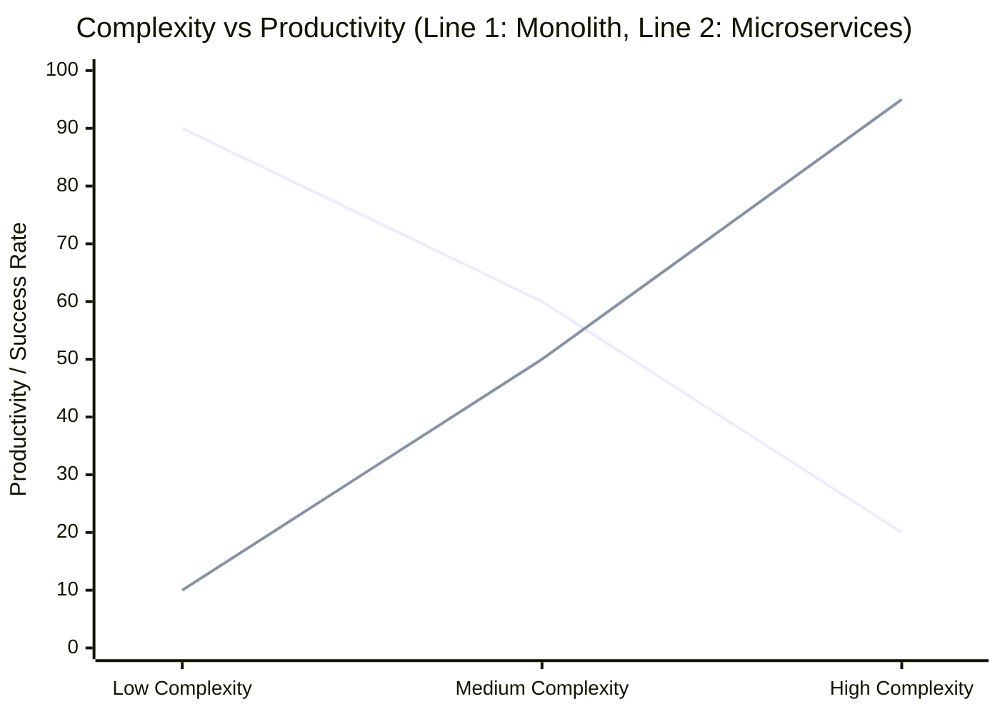

# Những hiểu lầm phổ biến về Microservices

Microservices là một kiến trúc mạnh mẽ, nhưng nó không phải là "viên đạn bạc" (silver bullet). Rất nhiều đội ngũ kỹ thuật lao vào áp dụng Microservices với những kỳ vọng sai lầm, dẫn đến việc hệ thống trở nên phức tạp, khó bảo trì và tốn kém hơn.

Bài học này sẽ đi sâu vào những hiểu lầm phổ biến nhất, kèm theo các ví dụ thực tế và biểu đồ minh họa.

## 1. Hiểu lầm: Microservices luôn "nhanh" và hiệu năng cao hơn Monolith

**🤔 Hiểu lầm:** Nhiều người cho rằng tách nhỏ ứng dụng ra sẽ làm cho từng phần chạy nhanh hơn.

**💡 Thực tế:**

- **Độ trễ mạng (Network Latency):** Trong Monolith, các module gọi nhau qua hàm (In-memory verification), tốn vài nanosecond. Trong Microservices, các service gọi nhau qua mạng (HTTP/gRPC), tốn vài millisecond đến hàng trăm millisecond.
- **Serialization/Deserialization:** Dữ liệu phải được đóng gói và giải nén liên tục giữa các service.

**Ví dụ Doanh nghiệp:**
Mọi người thường nghe **Netflix** hay **Uber** dùng Microservices để xử lý hàng triệu request. Tuy nhiên, họ chấp nhận **trade-off** (đánh đổi) về độ trễ của từng request riêng lẻ để đạt được khả năng **scale** (mở rộng) toàn hệ thống và độ sẵn sàng (availability) cao.

Nếu ứng dụng của bạn là một hệ thống giao dịch chứng khoán cần độ trễ thấp (low-latency trading), Microservices với REST API có thể là lựa chọn tồi tệ so với một Monolith được tối ưu tốt.

## 2. Hiểu lầm: "Micro" nghĩa là code phải thật nhỏ (Nano-services)

**🤔 Hiểu lầm:** Một service chỉ nên có 100 dòng code hoặc chỉ làm đúng một việc nhỏ xíu (ví dụ: service chỉ để... cộng hai số).

**💡 Thực tế:**

- Kích thước của Microservice không đo bằng dòng code (Lines of Code), mà đo bằng **Bounded Context** (Phạm vi ngữ cảnh nghiệp vụ).
- Nếu chia quá nhỏ, bạn sẽ gặp **Nano-services Anti-pattern**: overhead quản lý quá lớn, transaction phân tán ác mộng.

**Ví dụ Doanh nghiệp:**
Một công ty E-commerce tách module `Product` thành:

1. `GetProductNameService`
2. `UpdateProductPriceService`
3. `DeleteProductService`
   -> Đây là thảm họa.
   Thay vào đó, chỉ cần một `Catalog Service` bao trùm toàn bộ nghiệp vụ liên quan đến quản lý danh mục sản phẩm.

## 3. Hiểu lầm: Dùng chung Database cũng không sao

**🤔 Hiểu lầm:** Để tiện cho việc Join dữ liệu và làm báo cáo, các Services nên trỏ chung vào một Database lớn.

**💡 Thực tế:**

- Đây là vi phạm nguyên tắc cốt lõi **"Database per Service"**.
- Nếu Services dùng chung DB, chúng bị **Coupling (Phụ thuộc chặt)**. Bạn sửa schema bảng `Orders` cho Service A, Service B (đang query ké bảng đó) sẽ bị lỗi ngay lập tức.
- Bạn mất đi lợi ích của việc chọn công nghệ DB phù hợp cho từng service (Polyglot Persistence).

**Ví dụ Doanh nghiệp:**
Hệ thống ngân hàng Legacy thường có một "DB khổng lồ". Khi team Mobile App muốn thêm trường `device_id` vào bảng `Users`, họ phải xin phép team Web, team Reporting, và team Admin vì tất cả đều dùng chung bảng đó. Quy trình duyệt thay đổi mất 2 tuần.
Trong Microservices, `MobileService` có DB riêng, team có thể sửa schema bất cứ lúc nào mà không ảnh hưởng ai.

## 4. Hiểu lầm: Microservices làm giảm sự phức tạp

**🤔 Hiểu lầm:** Code base của Monolith quá lớn và rối rắm, tách ra sẽ đơn giản hơn.

**💡 Thực tế:**
Microservices **không loại bỏ sự phức tạp**, nó chỉ **chuyển dịch** sự phức tạp:

- Từ **Codebase Complexity** (Logic rối rắm trong 1 project)
- Sang **System Complexity** (Cấu hình mạng, Service Discovery, Distributed Tracing, Circuit Breaker, Deployment...).

Biểu đồ dưới đây minh họa sự thay đổi về năng suất (Productivity) theo độ phức tạp (Complexity) giữa Monolith và Microservices (Định luật Fowler về Microservices).

_(Ghi chú: Ở mức độ phức tạp thấp, Monolith thắng thế vượt trội. Chỉ khi hệ thống cực kỳ lớn và phức tạp, Microservices mới phát huy tác dụng)_

## 5. Hiểu lầm: Phải bắt đầu bằng Microservices (Microservices First)

**🤔 Hiểu lầm:** "Chúng ta là Startup công nghệ, chúng ta cần build giống Google/Netflix ngay từ ngày đầu tiên để sau này dễ scale."

**💡 Thực tế:**

- **Premature Optimization (Tối ưu hóa sớm)** là nguồn gốc của mọi tội lỗi.
- Khi mới bắt đầu, Domain Business chưa rõ ràng. Việc chia service sai sẽ dẫn đến "Distributed Monolith" (Monolith phân tán) - tệ hại hơn cả Monolith thường.
- **Chiến lược đúng:** Bắt đầu với **Modular Monolith** (Một khối thống nhất nhưng code chia module rõ ràng). Khi nào một module trở nên quá lớn hoặc cần scale độc lập -> Tách nó ra.

**Ví dụ Doanh nghiệp:**
**Stack Overflow** vẫn chạy trên kiến trúc **Monolithic** (.NET) và phục vụ hàng triệu người dùng cực nhanh.
**Segment** (công ty nổi tiếng về Customer Data) đã từng chuyển từ Monolith sang Microservices, rồi quay lại Monolith vì chi phí vận hành Microservices quá lớn so với lợi ích mang lại.

---

### Tổng kết

Microservices là một công cụ, không phải là mục đích. Hãy chọn Microservices khi bạn thực sự có vấn đề mà Monolith không giải quyết được (ví dụ: cần scale độc lập các team dev > 50 người, hoặc các module cần công nghệ hoàn toàn khác nhau).

> **Lời khuyên:** "Don't start with a monolith when your goal is a microservices architecture? No. **Always start with a monolith.**" - _Simon Brown_
