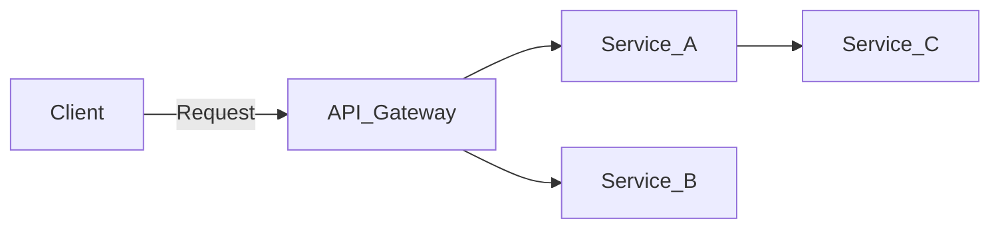
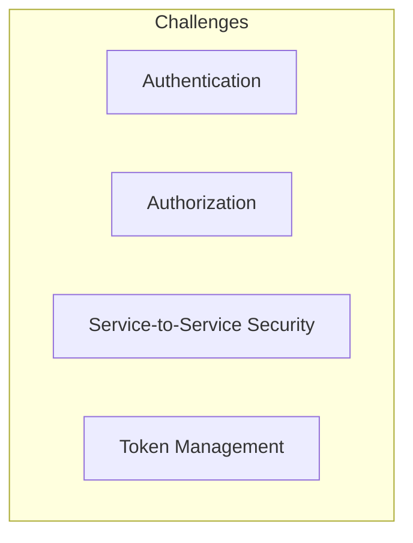
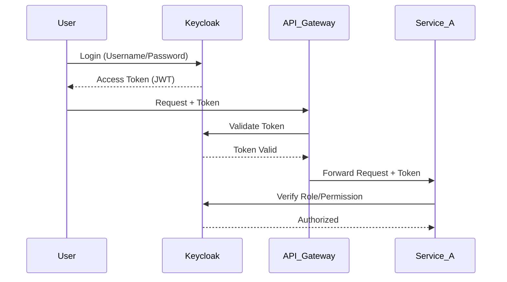

# Introduction to Security in Microservices

Trong phần này, chúng ta sẽ tìm hiểu **vì sao Security lại là vấn đề quan trọng trong kiến trúc Microservices** và cách mà chúng ta có thể giải quyết với Keycloak.

---

## 1. Vấn đề trong hệ thống monolithic vs microservices

- Với **Monolithic Application**, chúng ta thường chỉ có **một entry point**.

  - Dễ dàng đặt **Authentication & Authorization** ở ngay cổng vào.
  - Mọi request đều đi qua một luồng bảo mật duy nhất.

- Với **Microservices**, tình hình phức tạp hơn:
  - Có **nhiều service độc lập**.
  - Mỗi service có thể có **API riêng**.
  - Người dùng không chỉ gọi API trực tiếp, mà service này còn có thể gọi service khác.

👉 Câu hỏi đặt ra: **Chúng ta bảo mật thế nào trong một hệ thống phân tán như vậy?**

---

## 2. Thách thức bảo mật trong Microservices

Một số thách thức chính:

1. **Authentication (Xác thực người dùng)**

   - Ai đang gọi API này?
   - Người đó có hợp lệ hay không?

2. **Authorization (Phân quyền truy cập)**

   - Người dùng có quyền gọi endpoint này không?
   - Ví dụ: `admin` có thể tạo user mới, nhưng `customer` thì không.

3. **Service-to-Service Communication**

   - Làm sao để Service A biết rằng request từ Service B là hợp lệ?
   - Không thể chỉ tin tưởng vì "nó cùng nội bộ".

4. **Token Management**
   - Quản lý access token, refresh token, token expiration.
   - Đảm bảo hiệu năng khi phải xác thực hàng ngàn request mỗi giây.

---

## 3. Yêu cầu của một hệ thống bảo mật microservice

Một hệ thống microservice an toàn cần:

- **Centralized Authentication**: Xác thực tập trung, không lặp lại logic trong từng service.
- **Federated Identity**: Hỗ trợ đăng nhập qua Google, Facebook, LDAP...
- **Role-based Access Control (RBAC)**: Gán quyền theo role.
- **Scalability**: Hoạt động tốt với số lượng lớn request.

---

## 4. Giải pháp: Keycloak

[Keycloak](https://www.keycloak.org/) là một **Identity and Access Management (IAM)** platform mã nguồn mở. Nó giúp chúng ta giải quyết:

- Authentication (login/logout, SSO).
- Authorization (role, group, policy).
- Token-based security với OAuth2, OpenID Connect.
- Dễ dàng tích hợp với NestJS, Spring Boot, hay bất kỳ service nào.

---

## 5. Recap

- Monolithic dễ bảo mật hơn vì chỉ có một điểm vào.
- Microservices yêu cầu **distributed security**: authentication, authorization, token, service-to-service.
- Keycloak cung cấp một giải pháp **tập trung, hiện đại, mở rộng** để quản lý danh tính và phân quyền.

👉 Ở các video tiếp theo, chúng ta sẽ cài đặt và tích hợp Keycloak với NestJS microservice.

---
