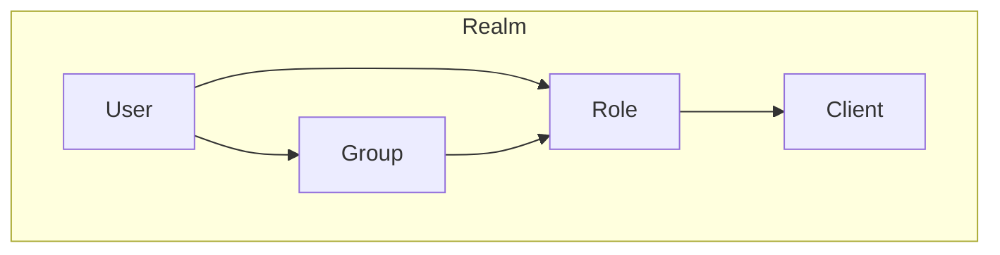
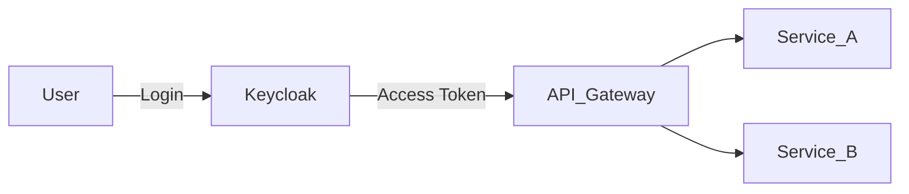

# Keycloak Overview

Trong phần này, chúng ta sẽ tìm hiểu **Keycloak là gì**, các **khái niệm quan trọng** trong Keycloak và cách nó giúp giải quyết vấn đề bảo mật trong hệ thống Microservices.

---

## 1. Keycloak là gì?


- **Keycloak** là một **Identity and Access Management (IAM)** platform mã nguồn mở do Red Hat phát triển.
- Nó cung cấp sẵn **Authentication & Authorization** mà không cần tự xây từ đầu.
- Hỗ trợ các chuẩn bảo mật hiện đại:
  - **OAuth2**
  - **OpenID Connect (OIDC)**
  - **SAML 2.0**

👉 Hiểu đơn giản: Keycloak chính là **“trung tâm quản lý danh tính và quyền hạn”** cho toàn bộ hệ thống Microservices.

---

## 2. Các khái niệm chính trong Keycloak

- **Realm**: không gian quản lý độc lập trong Keycloak. Mỗi realm có user, role, client riêng.
- **Client**: ứng dụng (web, backend, microservice) cần sử dụng Keycloak để xác thực.
- **User**: người dùng cuối cùng. Có thể gán vào role hoặc group.
- **Role**: tập quyền được gán cho user hoặc client.
- **Group**: nhóm user, giúp quản lý role theo tập thể.



👉 Ví dụ:

- Realm: `my-company`
- Client: `order-service`, `user-service`
- User: `alice`, `bob`
- Role: `admin`, `customer`

---

## 3. Keycloak trong hệ thống Microservices



- Tất cả user đăng nhập qua **Keycloak**.
- Keycloak trả về **JWT Token**.
- Token này được gửi kèm khi gọi API tới Gateway hoặc các microservice.

---

## 4. Lợi ích khi dùng Keycloak

- Không phải tự viết logic login/logout.
- Hỗ trợ Single Sign-On (SSO).
- Dễ mở rộng: có thể kết nối LDAP, Google, Facebook, GitHub.
- Tích hợp được với nhiều công nghệ (NestJS, Spring Boot, .NET, v.v.).

---

# Setup Keycloak

Trong phần này, chúng ta sẽ cùng **cài đặt và cấu hình cơ bản Keycloak**.

---

## 1. Cài đặt Keycloak bằng Docker

File `docker-compose.yml`:

```yaml
version: '3'
services:
  keycloak:
    image: quay.io/keycloak/keycloak:25.0.0
    container_name: keycloak-25.0.0
    ports:
      - '8180:8080'
    environment:
      KEYCLOAK_ADMIN: admin
      KEYCLOAK_ADMIN_PASSWORD: admin

    command: start-dev
    restart: unless-stopped
    volumes:
      - ./docker/docker_data/keycloak_data:/opt/keycloak/data
    networks:
      - einvoice-nw
```

Chạy lệnh:

```bash
docker compose up -d
```

👉 Truy cập `http://localhost:8080` để mở giao diện Keycloak.  
Đăng nhập với username/password: `admin / admin`.

---

## 2. Tạo Realm

- Vào trang quản trị → `Create Realm`.
- Ví dụ đặt tên: `microservices-realm`.

---

## 3. Tạo Client

- Trong realm → `Clients` → `Create`.
- Ví dụ client: `order-service`.
- Chọn **Client Protocol = OpenID Connect**.
- Chọn **Access Type = confidential** (nếu service cần secret key).

---

## 4. Tạo User & Role

1. Vào `Users` → `Add User`.

   - Username: `alice`
   - Đặt password: `123456`

2. Vào `Roles` → `Add Role`.

   - Role: `admin`

3. Gán role cho user `alice`.

---

## 5. Test đăng nhập

- Truy cập `http://localhost:8080/realms/microservices-realm/account`.
- Đăng nhập bằng user `alice`.
- Keycloak sẽ trả về **Access Token (JWT)**.

👉 Access Token này sẽ được sử dụng khi gọi API trong microservices.

---

## 6. Recap

- Keycloak là **trung tâm quản lý danh tính & phân quyền**.
- Các khái niệm chính: Realm, Client, User, Role, Group.
- Chúng ta đã setup Keycloak cơ bản với Docker, tạo Realm, Client, User, Role.
- Access Token từ Keycloak sẽ là chìa khóa để bảo mật Microservices.

---
