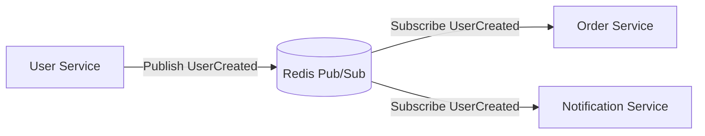
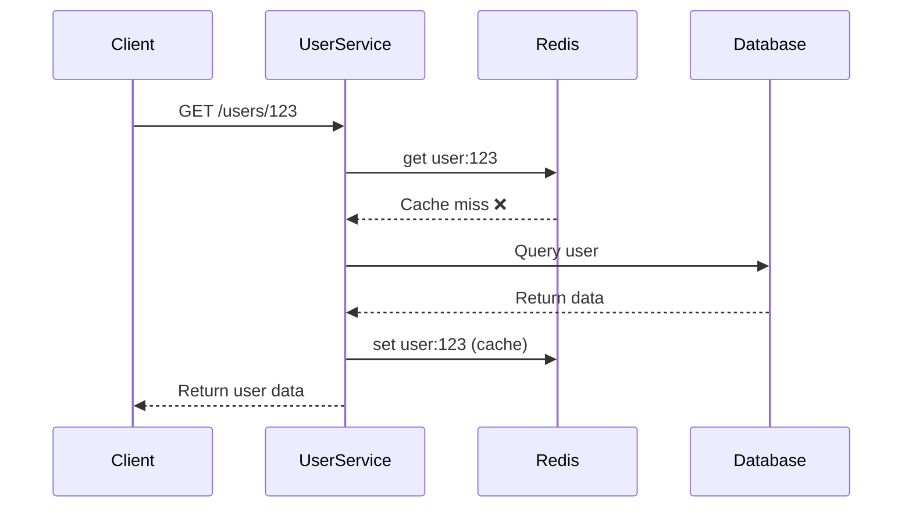
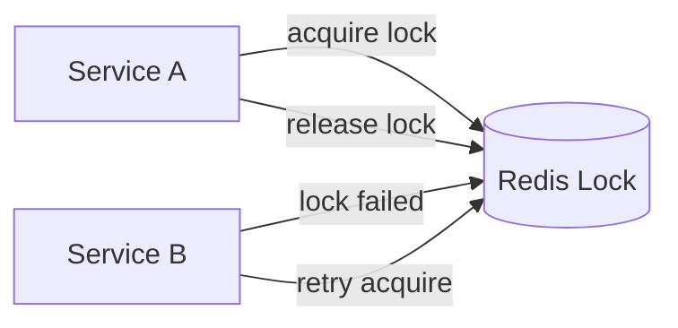
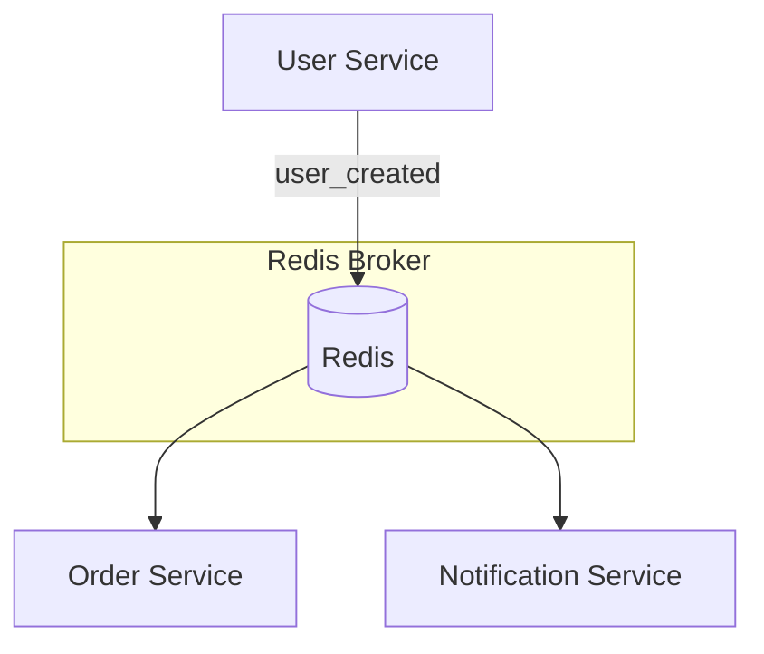

# 🚀 Ứng dụng Redis trong hệ thống NestJS Microservices

## 🎯 Mục tiêu bài học

Sau bài này, bạn sẽ hiểu được:

- Redis đóng vai trò gì trong hệ thống Microservice.
- Các pattern phổ biến sử dụng Redis: **Pub/Sub**, **Caching**, **Distributed Locking**.
- Cách tích hợp Redis trong NestJS theo từng use case cụ thể.
- Demo kiến trúc thực tế.

---

## ⚙️ Redis là gì?

Redis là **in-memory data store** — tốc độ truy cập cực nhanh, thường được sử dụng để:

- Cache dữ liệu tạm thời.
- Trao đổi message giữa các service (Pub/Sub).
- Lưu session, rate limit, queue,...

Redis cực kỳ phù hợp trong **hệ thống phân tán** như **microservice architecture** vì:

- Có thể giao tiếp giữa các service mà không cần HTTP.
- Giảm tải database chính.
- Đảm bảo dữ liệu tạm thời và hiệu năng cao.

---

## 🏗️ Redis trong hệ thống Microservice

Hãy tưởng tượng hệ thống của bạn gồm 3 service:

- **User Service**
- **Order Service**
- **Notification Service**

Thay vì các service này gọi HTTP chéo nhau, ta có thể kết nối qua **Redis Pub/Sub channel**.



✅ **Lợi ích:**

- Service không cần biết endpoint của nhau.
- Dễ mở rộng thêm consumer mà không phải chỉnh sửa code ở publisher.
- Giảm coupling giữa các service.

---

## 🧩 1. Redis Pub/Sub với NestJS Microservices

NestJS hỗ trợ Redis như **transport layer** mặc định.

### Ví dụ

```ts
// main.ts (User Service)
async function bootstrap() {
  const app = await NestFactory.createMicroservice<MicroserviceOptions>(UserModule, {
    transport: Transport.REDIS,
    options: {
      host: 'localhost',
      port: 6379,
    },
  });
  await app.listen();
}
bootstrap();
```

```ts
// user.service.ts
@Injectable()
export class UserService {
  constructor(@InjectRedisClient() private client: RedisClientType) {}

  async createUser(data: CreateUserDto) {
    const user = await this.userRepo.create(data);
    this.client.publish('user_created', JSON.stringify(user));
    return user;
  }
}
```

```ts
// order.service.ts (Subscriber)
@MessagePattern('user_created')
handleUserCreated(@Payload() user: any) {
  this.orderService.initOrderForUser(user.id);
}
```

---

## ⚡ 2. Redis Cache — Tăng tốc hệ thống

Một trong những vấn đề lớn của microservice là **truy vấn chồng chéo**.

Ví dụ: nhiều service cùng query `UserProfile` từ database trung tâm.  
Ta dùng Redis cache để giảm truy cập DB.



Ví dụ tích hợp Redis cache:

```ts
@Injectable()
export class UserCacheService {
  constructor(@InjectRedis() private redis: Redis) {}

  async getUser(userId: string) {
    const cached = await this.redis.get(`user:${userId}`);
    if (cached) return JSON.parse(cached);

    const user = await this.userRepo.findById(userId);
    await this.redis.set(`user:${userId}`, JSON.stringify(user), 'EX', 60);
    return user;
  }
}
```

---

## 🔐 3. Distributed Locking (Khoá phân tán)

Trong hệ thống microservice, có những tác vụ chỉ nên chạy **một lần tại một thời điểm** (ví dụ: xử lý thanh toán).

Redis có thể hỗ trợ qua **Redlock** pattern.



Ví dụ với thư viện `redlock`:

```ts
import Redlock from 'redlock';

const redlock = new Redlock([redisClient]);

async function processPayment(orderId: string) {
  const lock = await redlock.acquire([`lock:payment:${orderId}`], 5000);
  try {
    await paymentService.handle(orderId);
  } finally {
    await lock.release();
  }
}
```

---

## 🚀 Kết hợp tất cả – Mini Project Overview

Chúng ta sẽ build mini project gồm 3 service:

1. **User Service** → tạo user, publish event.
2. **Order Service** → lắng nghe event user_created.
3. **Notification Service** → gửi email khi có user mới.

Cấu trúc tổng thể:



---

## 🧩 Tổng kết

| Use Case                     | Redis Pattern    | Mục đích             |
| ---------------------------- | ---------------- | -------------------- |
| Giao tiếp giữa service       | Pub/Sub          | Giảm coupling        |
| Giảm tải database            | Cache            | Tăng tốc độ truy cập |
| Đảm bảo chỉ 1 instance xử lý | Distributed Lock | Ngăn race condition  |

---

## 💡 Bài tập thực hành

1. Cài Redis local hoặc dùng Docker.
2. Tạo 2 microservice: `user-service` và `order-service`.
3. Khi tạo user → publish event.
4. `order-service` subscribe và tạo order mặc định.
5. Thêm Redis cache cho `getUserById`.

---

## ✅ Kết luận

Redis không chỉ là cache — mà là **một thành phần quan trọng giúp microservice của bạn nhanh, ổn định và dễ mở rộng**.
