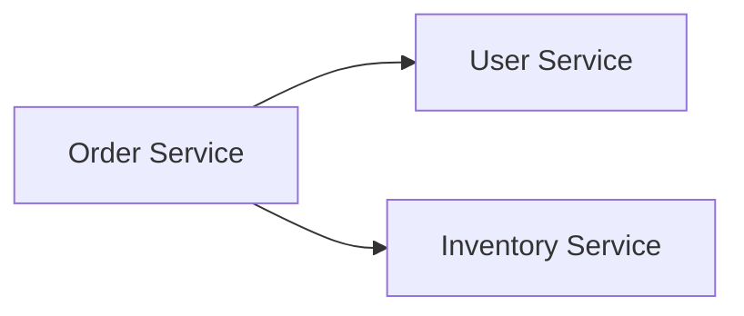
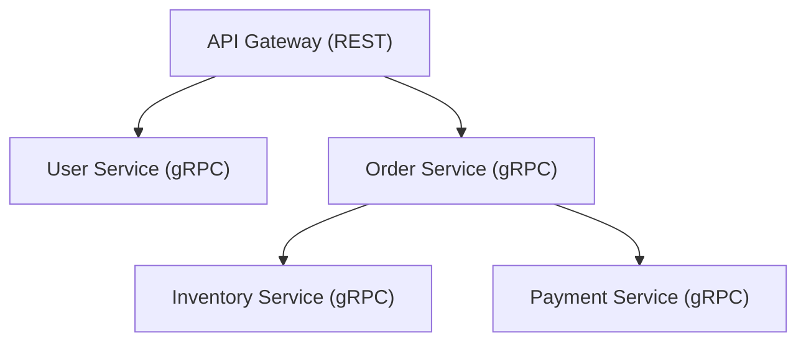
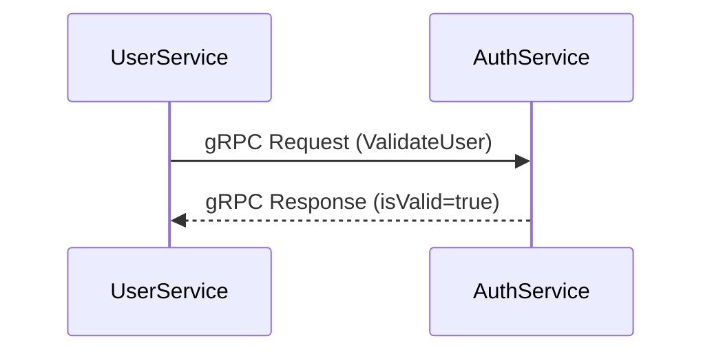
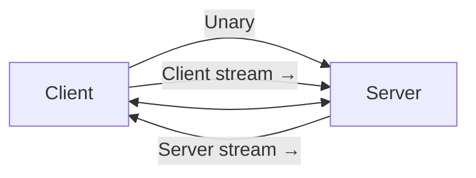

# 🧩 gRPC trong mô hình Microservices

## 🎯 Mục tiêu học tập

Sau bài học này, học viên sẽ:

- Hiểu **bản chất của gRPC** và cách nó khác với REST.
- Nắm được **lý do tại sao microservice hiện đại cần gRPC**.
- Hình dung được **cách gRPC vận hành giữa các service** thông qua các ví dụ và sơ đồ trực quan.

---

## 🧠 1. gRPC là gì?

### 🔹 Định nghĩa ngắn gọn

**gRPC (Google Remote Procedure Call)** là một framework giao tiếp giữa các service, cho phép **một service gọi hàm trong service khác** như thể chúng nằm trong cùng một ứng dụng.

Nó được xây dựng dựa trên:

- **Protocol Buffers (protobuf)** để định nghĩa cấu trúc dữ liệu.
- **HTTP/2** để truyền dữ liệu hiệu quả, hỗ trợ multiplexing, streaming và compression.

---

### 🔹 Ví dụ thực tế

Giả sử bạn có 3 service trong hệ thống eCommerce:



Khi người dùng đặt hàng:

- `Order Service` cần gọi `User Service` để kiểm tra người dùng hợp lệ.
- Sau đó gọi `Inventory Service` để trừ hàng tồn.

Nếu dùng REST, mỗi lần gọi là một **HTTP request**, phải encode/decode JSON.  
Nếu dùng **gRPC**, bạn chỉ cần gọi hàm `validateUser()` hoặc `updateStock()` như trong code nội bộ — **nhanh hơn, gọn hơn và strongly-typed**.

---

### 🔹 Định nghĩa hàm trong `.proto`

```proto
syntax = "proto3";

package order;

service OrderService {
  rpc PlaceOrder (OrderRequest) returns (OrderResponse);
}

message OrderRequest {
  string userId = 1;
  string productId = 2;
  int32 quantity = 3;
}

message OrderResponse {
  string orderId = 1;
  bool success = 2;
}
```

> 👉 Đây chính là “hợp đồng giao tiếp” (communication contract) giữa các service.

---

## ⚙️ 2. Vì sao cần gRPC trong mô hình microservices?

### 🧩 Thực trạng khi dùng REST giữa microservices

REST API đơn giản, dễ test, nhưng có nhiều **vấn đề khi scale hệ thống lớn**:

| Vấn đề                   | REST gặp phải                                               |
| ------------------------ | ----------------------------------------------------------- |
| Hiệu năng thấp           | JSON text-based, nhiều overhead.                            |
| Type safety yếu          | Dễ lỗi khi thay đổi schema dữ liệu.                         |
| Streaming kém            | Không hỗ trợ truyền dữ liệu liên tục (ví dụ real-time log). |
| Inter-service complexity | Phải tự quản lý endpoint URL, version, status code...       |

---

### 💡 gRPC giải quyết thế nào?

| Khía cạnh         | gRPC cải thiện                                                               |
| ----------------- | ---------------------------------------------------------------------------- |
| ⚡ Hiệu năng      | Truyền dữ liệu dạng binary qua Protocol Buffers → nhanh gấp 5–10 lần JSON.   |
| 🔒 Type-safe      | Interface được định nghĩa trong `.proto`, generate code tự động.             |
| 🌍 Đa ngôn ngữ    | Dễ kết nối service viết bằng Go, Python, Java, Node.js...                    |
| 🚀 Streaming      | Hỗ trợ 4 kiểu giao tiếp: Unary, Server stream, Client stream, Bidirectional. |
| 🧱 Contract-first | Cấu trúc API rõ ràng và đồng bộ giữa các team.                               |


---

### 🔧 Tình huống ứng dụng thực tế

Ví dụ hệ thống gồm nhiều microservice:



- Frontend chỉ nói chuyện với **API Gateway qua REST**.
- Bên trong hệ thống, các service giao tiếp qua **gRPC** → tốc độ cao, ít overhead, dễ maintain.

> 💬 Đây là mô hình “Hybrid Communication”: REST cho client-facing, gRPC cho inter-service communication.

---

### 🚀 Lợi ích rõ ràng khi áp dụng gRPC trong Microservice

1. **Tối ưu performance:** Binary serialization giúp giảm băng thông.
2. **Đồng bộ schema:** Không còn lo mismatch giữa client và server.
3. **Hỗ trợ CI/CD:** Thay đổi contract `.proto` → tự động generate client code cho tất cả service.
4. **Giảm boilerplate:** Code gọi RPC giống gọi hàm nội bộ.

---

## 🔄 3. gRPC hoạt động như thế nào?

### 🔹 Tổng quan cơ chế



1. **Client** gọi hàm từ stub (được generate từ file `.proto`).
2. **Stub** serialize dữ liệu sang binary (protobuf).
3. Dữ liệu được gửi qua **HTTP/2** tới server.
4. **Server** deserialize dữ liệu và xử lý logic.
5. Trả kết quả lại cho client theo cùng định dạng.

---

### 🔹 Kiểu giao tiếp trong gRPC

| Kiểu             | Mô tả                      | Ứng dụng thực tế             |
| ---------------- | -------------------------- | ---------------------------- |
| Unary            | 1 request ↔ 1 response     | Login, Validate User         |
| Server Streaming | 1 request → nhiều response | Log stream, file download    |
| Client Streaming | nhiều request → 1 response | Upload nhiều file            |
| Bidirectional    | 2 chiều liên tục           | Chat, IoT, real-time trading |



---

### 🧩 Một ví dụ đơn giản trong Node/NestJS

```proto
service AuthService {
  rpc ValidateUser (UserRequest) returns (UserResponse);
}

message UserRequest {
  string email = 1;
  string password = 2;
}

message UserResponse {
  bool isValid = 1;
}
```

Client gọi:

```typescript
const res = await authService.validateUser({ email, password });
```

Tưởng như gọi hàm cục bộ, nhưng thực tế:

- NestJS dùng gRPC transport.
- Dữ liệu được encode bằng protobuf, gửi qua HTTP/2 đến AuthService.

---

## 📈 Tổng kết bài học

| Nội dung chính   | Ghi nhớ                                                        |
| ---------------- | -------------------------------------------------------------- |
| gRPC là gì       | Framework RPC sử dụng Protocol Buffers và HTTP/2               |
| Vì sao dùng gRPC | Tăng hiệu năng, type-safe, tối ưu giao tiếp giữa microservices |
| gRPC hoạt động   | Serialize dữ liệu binary, truyền qua HTTP/2 giữa Client–Server |

> 🔜 Ở **bài tiếp theo**, chúng ta sẽ **cài đặt thực tế microservice NestJS sử dụng gRPC**:  
> Tạo `AuthService` và `UserService` giao tiếp với nhau qua `.proto` file.
