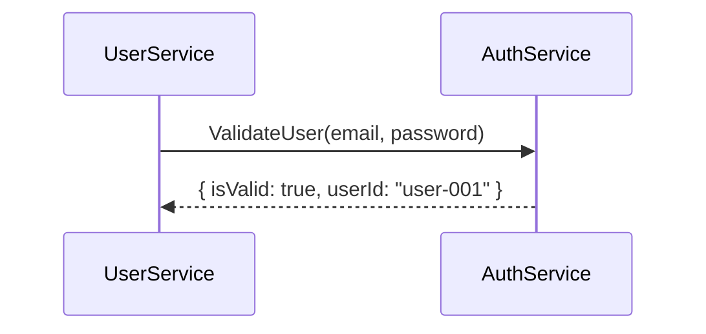

# ⚙️ Xây dựng NestJS Microservice với gRPC

## 🎯 Mục tiêu học tập

- Hiểu cách NestJS hỗ trợ gRPC.
- Tạo service server và client với gRPC.
- Thực hành truyền data giữa hai service (Auth ↔ User).
- Chạy thử toàn bộ flow và test kết quả.

---

## 📦 1. Chuẩn bị môi trường

```bash
npm install @nestjs/microservices @grpc/grpc-js @grpc/proto-loader
```

Cấu trúc project:

```
/apps
 ├── auth-service
 ├── user-service
/proto
 └── auth.proto
```

---

## 📘 2. Tạo file `auth.proto`

```proto
syntax = "proto3";

package auth;

service AuthService {
  rpc ValidateUser (ValidateUserRequest) returns (ValidateUserResponse);
}

message ValidateUserRequest {
  string email = 1;
  string password = 2;
}

message ValidateUserResponse {
  bool isValid = 1;
  string userId = 2;
}
```

---

## 🔹 3. Cấu hình AuthService (Server)

```typescript
// main.ts
import { NestFactory } from '@nestjs/core';
import { AppModule } from './app.module';
import { MicroserviceOptions, Transport } from '@nestjs/microservices';
import { join } from 'path';

async function bootstrap() {
  const app = await NestFactory.createMicroservice<MicroserviceOptions>(AppModule, {
    transport: Transport.GRPC,
    options: {
      package: 'auth',
      protoPath: join(__dirname, '../proto/auth.proto'),
      url: '0.0.0.0:50051',
    },
  });
  await app.listen();
}
bootstrap();
```

```typescript
// auth.controller.ts
import { Controller } from '@nestjs/common';
import { GrpcMethod } from '@nestjs/microservices';

@Controller()
export class AuthController {
  @GrpcMethod('AuthService', 'ValidateUser')
  validateUser(data: { email: string; password: string }) {
    if (data.email === 'test@mail.com' && data.password === '123456') {
      return { isValid: true, userId: 'user-001' };
    }
    return { isValid: false, userId: '' };
  }
}
```

---

## 🔸 4. Cấu hình UserService (Client)

```typescript
// user.module.ts
import { Module } from '@nestjs/common';
import { ClientsModule, Transport } from '@nestjs/microservices';
import { join } from 'path';
import { UserController } from './user.controller';
import { UserService } from './user.service';

@Module({
  imports: [
    ClientsModule.register([
      {
        name: 'AUTH_PACKAGE',
        transport: Transport.GRPC,
        options: {
          package: 'auth',
          protoPath: join(__dirname, '../proto/auth.proto'),
          url: 'localhost:50051',
        },
      },
    ]),
  ],
  controllers: [UserController],
  providers: [UserService],
})
export class UserModule {}
```

```typescript
// user.service.ts
import { Inject, Injectable } from '@nestjs/common';
import { ClientGrpc } from '@nestjs/microservices';
import { lastValueFrom } from 'rxjs';

interface AuthService {
  validateUser(data: { email: string; password: string }): any;
}

@Injectable()
export class UserService {
  private authService: AuthService;

  constructor(@Inject('AUTH_PACKAGE') private client: ClientGrpc) {}

  onModuleInit() {
    this.authService = this.client.getService<AuthService>('AuthService');
  }

  async login(email: string, password: string) {
    return await lastValueFrom(this.authService.validateUser({ email, password }));
  }
}
```

---

## 🔄 5. Flow hoạt động



---

## 🧪 6. Demo và kiểm thử

1. Chạy AuthService:
   ```bash
   npm run start:dev auth-service
   ```
2. Chạy UserService:
   ```bash
   npm run start:dev user-service
   ```
3. Gửi request đến UserService (REST hoặc GraphQL endpoint nếu có).  
   Xem log để thấy UserService gọi qua gRPC đến AuthService.

---

## 📈 7. Tổng kết

| Thành phần       | Vai trò                               |
| ---------------- | ------------------------------------- |
| `.proto`         | Định nghĩa interface giữa các service |
| `AuthService`    | gRPC server                           |
| `UserService`    | gRPC client                           |
| `Transport.GRPC` | Cấu hình kết nối giữa 2 service       |

> 🧠 Gợi ý nâng cao: Bạn có thể thêm middleware logging gRPC request hoặc handle error bằng interceptor.

---

## 💡 Bài tập nâng cao

1. Tạo thêm `OrderService` gọi `AuthService` qua gRPC để xác thực user.
2. Implement thêm 1 method mới trong `.proto` – ví dụ: `GetUserProfile`.
3. Thử benchmark thời gian phản hồi giữa REST vs gRPC.
