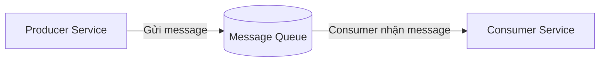
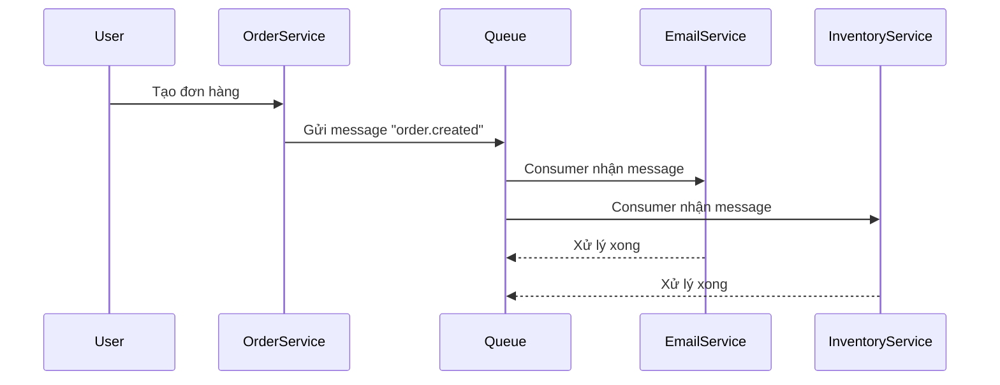
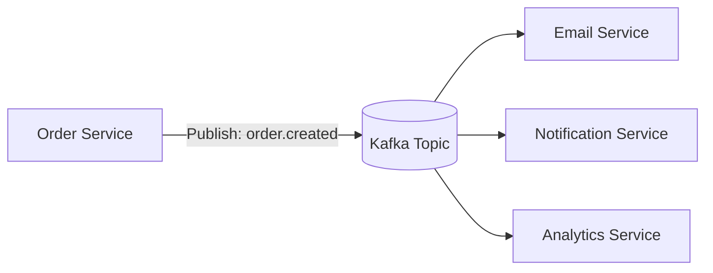

# 🎯 Bài học: Message Queue là gì và tại sao cần trong Microservice

## 1. Giới thiệu

Trong các hệ thống **microservices**, việc các service giao tiếp với
nhau là điều không thể tránh khỏi. Tuy nhiên, nếu ta để các service
**gọi trực tiếp (synchronous)** đến nhau qua HTTP thì sẽ gặp nhiều vấn
đề như:

- Hiệu năng kém do phải chờ response.
- Độ tin cậy thấp: chỉ cần 1 service lỗi là cả flow bị dừng.
- Khó mở rộng, khó bảo trì.

👉 Lúc này, **Message Queue (MQ)** xuất hiện như một giải pháp mạnh mẽ
giúp **tách biệt, tối ưu và ổn định** luồng giao tiếp giữa các service.

---

## 2. Message Queue là gì?

**Message Queue** là một **hệ thống trung gian (middleware)** giúp
**gửi, lưu trữ và phân phối message** giữa các service.

Các thành phần chính:

- **Producer**: service gửi message vào queue (ví dụ: khi user đăng
  ký, gửi thông tin đăng ký).
- **Queue/Broker**: lưu trữ message tạm thời, đảm bảo message không bị
  mất.
- **Consumer**: service nhận message từ queue và xử lý.

---

## 3. Vì sao cần Message Queue trong Microservice?

### ⚡ 3.1 Giảm coupling giữa các service

Producer không cần biết Consumer là ai, chỉ cần "bắn message" vào queue.
=\> Dễ mở rộng, dễ thay đổi, không ảnh hưởng hệ thống khác.

### ⏱️ 3.2 Tăng hiệu năng và khả năng chịu tải

Thay vì xử lý trực tiếp (blocking), producer có thể đẩy task vào queue
và phản hồi cho user ngay.

**Ví dụ thực tế:** Khi người dùng thanh toán đơn hàng, hệ thống có
thể: - Gửi email xác nhận - Cập nhật điểm thưởng - Gửi thông tin sang hệ
thống kho

Nếu xử lý trực tiếp =\> user phải chờ lâu. Nếu dùng MQ =\> chỉ cần đẩy
event `order.created` vào queue, các service khác tự xử lý sau.

### 💪 3.3 Tăng khả năng chịu lỗi (Fault Tolerance)

Khi Consumer bị down, Queue vẫn giữ message cho đến khi Consumer hoạt
động lại.

### 🚀 3.4 Hỗ trợ scale độc lập

Nếu EmailService quá tải, ta chỉ cần tăng số lượng consumer mà không ảnh
hưởng service khác.

---

## 4. Thực tế triển khai trong dự án

Trong các dự án thực tế (ví dụ hệ thống thanh toán, e-commerce,
logistics...), các message queue phổ biến thường được sử dụng là:

---

Broker Đặc điểm nổi bật

---

**RabbitMQ** Phù hợp với event nhỏ, yêu cầu đảm bảo message
delivery

**Apache Kafka** Dùng cho dữ liệu lớn, event streaming, xử lý
real-time

**AWS SQS / Google Dịch vụ cloud, dễ scale và quản lý
PubSub**

---

Ví dụ thực tế trong dự án e-commerce:

- Khi người dùng **đặt hàng**, service `OrderService` publish event
  `order.created` lên Kafka.
- `EmailService` subscribe topic đó để **gửi email xác nhận**.
- `NotificationService` nhận cùng event để **gửi thông báo realtime**
  qua WebSocket.

---

## 5. Một số kinh nghiệm thực tế

- 🔁 **Thiết kế message idempotent** để tránh xử lý trùng message.
- 🧱 **Dùng DLQ (Dead Letter Queue)** để lưu các message lỗi không xử
  lý được.
- 📊 **Theo dõi lag của consumer** (Kafka lag) để phát hiện service
  quá tải.
- 🔐 **Bảo mật và phân quyền** khi nhiều service cùng truy cập broker.
- 🧩 **Log và trace message** bằng correlation id giúp debug dễ dàng.

---

## 6. Kết luận

Message Queue không chỉ giúp hệ thống microservice hoạt động hiệu quả
hơn mà còn mang lại:

- Khả năng mở rộng cao.
- Độ tin cậy tốt.
- Kiến trúc linh hoạt, dễ bảo trì.

> 💡 "Nếu hệ thống của bạn cần scale, cần realtime, hoặc cần xử lý event
> bất đồng bộ --- thì Message Queue là lựa chọn không thể thiếu."
