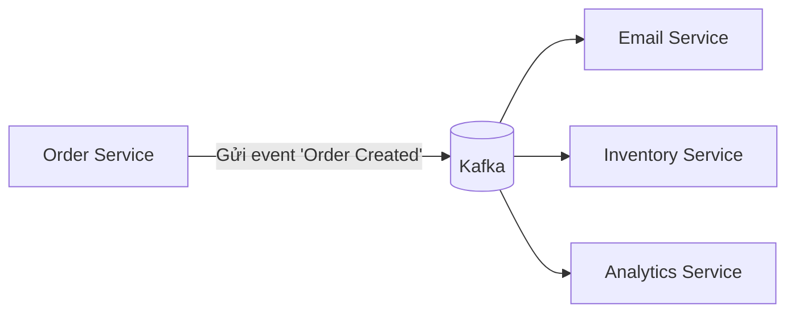
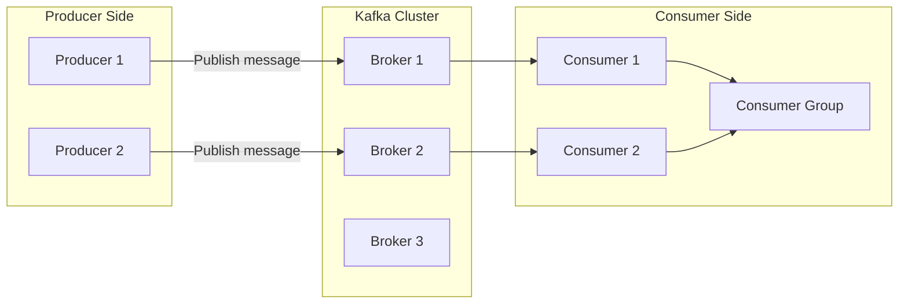
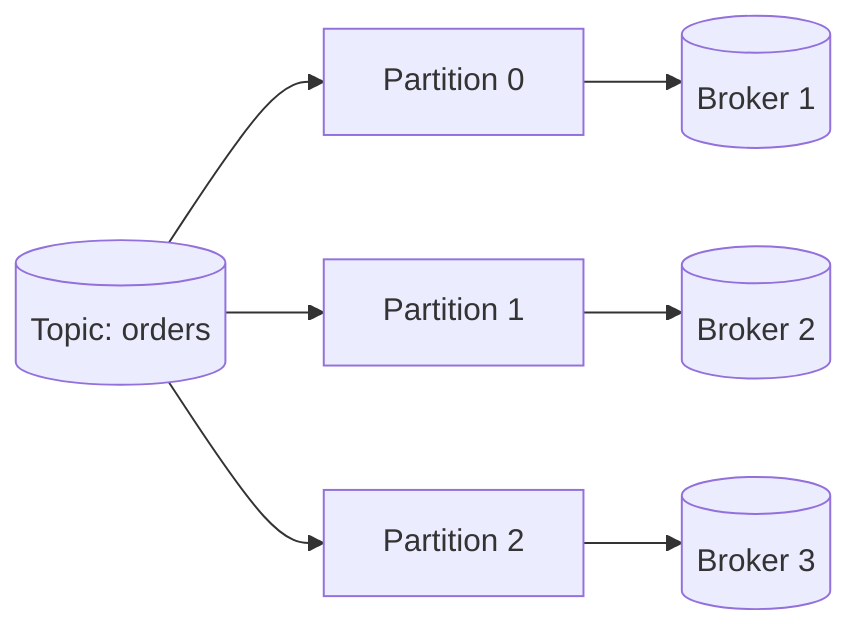
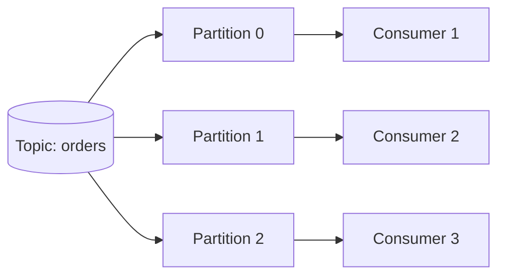
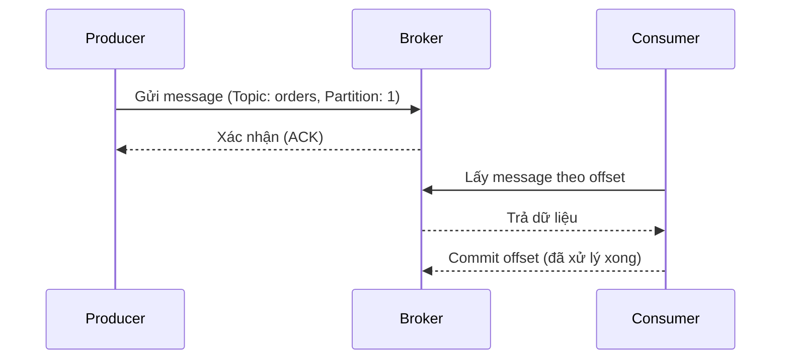

# 🧭 Bài học: Hiểu rõ Apache Kafka và các thành phần cốt lõi

## 1. Apache Kafka là gì?

**Apache Kafka** là một nền tảng **event streaming phân tán** được thiết kế để **xử lý luồng dữ liệu theo thời gian thực (real-time)**.  
Nói cách khác, Kafka giống như **một hệ thống “bưu điện số”** — nơi dữ liệu (thư) được gửi đi từ nơi này đến nơi khác một cách **an toàn, nhanh chóng và có thể mở rộng**.

### 💡 Ví dụ dễ hiểu:

Hãy tưởng tượng bạn điều hành một công ty thương mại điện tử.  
Khi người dùng đặt hàng, có rất nhiều việc cần diễn ra:

- Gửi email xác nhận đơn hàng.
- Cập nhật kho hàng.
- Ghi log giao dịch.
- Gửi dữ liệu sang hệ thống phân tích doanh thu.

Thay vì các hệ thống này phải **gọi trực tiếp lẫn nhau** (dẫn đến phụ thuộc chặt chẽ), ta dùng **Kafka** làm trung gian để truyền thông điệp giữa chúng.

Kafka giúp **các hệ thống hoạt động độc lập** nhưng vẫn **liên kết thông qua luồng sự kiện**.

---

## 2. Kiến trúc tổng thể của Apache Kafka

Kafka gồm nhiều thành phần phối hợp với nhau. Cùng tìm hiểu chi tiết từng phần nhé 👇

---

## 3. Các thành phần chính của Apache Kafka

### 📨 3.1 Producer – Người gửi tin

Producer là **thành phần tạo ra và gửi dữ liệu** đến Kafka.

- Nó gửi message đến một **Topic** cụ thể.
- Có thể lựa chọn **partition** để gửi message đến (thường dùng key để Kafka phân bổ).

💡 **Ví dụ đời sống:**  
Giống như người gửi thư. Bạn (Producer) gửi thư đến một “phòng bưu điện” (Topic), rồi Kafka đảm bảo thư đến đúng nơi.

---

### 🧱 3.2 Broker – Máy chủ Kafka

- Mỗi **Broker** là một node trong cụm Kafka.
- Broker chịu trách nhiệm **lưu trữ dữ liệu** và **phục vụ request** từ Producer và Consumer.
- Một cụm Kafka thường có nhiều Broker để đảm bảo **khả năng chịu lỗi (fault tolerance)** và **tăng throughput**.

💡 **Ví dụ đời sống:**  
Mỗi Broker giống như **một chi nhánh bưu điện** — lưu trữ và xử lý một phần thư.  
Nếu một chi nhánh bưu điện bị hỏng, các chi nhánh khác vẫn tiếp tục hoạt động.

---

### 🗂 3.3 Topic – Kênh dữ liệu

- Kafka tổ chức dữ liệu theo **Topic**, hiểu đơn giản là **chủ đề hoặc loại sự kiện**.
- Ví dụ: `orders`, `payments`, `emails` là các topic khác nhau.

💡 **Ví dụ đời sống:**  
Giống như trong bưu điện, có nhiều “hòm thư” cho từng loại thư — thư doanh nghiệp, thư cá nhân, thư khẩn…  
Producer chỉ việc “thả thư” đúng hòm (Topic).

---

### 🧩 3.4 Partition – Chia nhỏ dữ liệu trong Topic

- Mỗi Topic được chia thành nhiều **Partition** để **phân tán dữ liệu** và **tăng tốc độ xử lý song song**.
- Mỗi Partition được lưu trên **các Broker khác nhau**.
- Message trong partition được **xếp theo thứ tự thời gian** (order guarantee).

💡 **Ví dụ đời sống:**  
Nếu hòm thư (Topic) có quá nhiều thư, ta chia thành nhiều “ngăn thư” nhỏ (Partition) để nhiều nhân viên (Consumer) xử lý song song.

---

### 🧾 3.5 Offset – Vị trí của message

- Mỗi message trong partition có một **số thứ tự duy nhất** gọi là **offset**.
- Offset giúp Kafka và Consumer biết **message nào đã đọc, message nào chưa**.

💡 **Ví dụ đời sống:**  
Giống như số thứ tự trên mỗi bức thư trong ngăn thư — giúp bạn biết mình đã xử lý đến đâu.

---

### 👥 3.6 Consumer – Người nhận dữ liệu

- Consumer là **ứng dụng đọc message từ Kafka**.
- Consumer có thể đọc từ nhiều topic và partition khác nhau.
- Kafka cho phép consumer **chủ động “pull” dữ liệu**, giúp kiểm soát tốc độ đọc.

💡 **Ví dụ đời sống:**  
Consumer giống như nhân viên bưu điện đến lấy thư từ ngăn của mình để xử lý.

---

### 🧑‍🤝‍🧑 3.7 Consumer Group – Nhóm người nhận

- Một **Consumer Group** là tập hợp nhiều consumer cùng đọc dữ liệu từ **một topic**.
- Mỗi partition chỉ được xử lý bởi **một consumer trong nhóm** → đảm bảo không bị trùng.
- Giúp **scale horizontal** (tăng số consumer để tăng tốc độ xử lý).

💡 **Ví dụ đời sống:**  
Nếu bạn có 3 nhân viên cùng xử lý thư, thì mỗi người sẽ nhận 1 ngăn riêng — không ai xử lý trùng.

---

### 🧩 3.8 Cluster – Cụm Kafka

- Kafka **Cluster** là tập hợp nhiều Broker cùng hoạt động như một hệ thống thống nhất.
- Dữ liệu được **replicate (sao lưu)** giữa các broker để đảm bảo an toàn.
- Khi một broker bị lỗi, **leader partition** sẽ chuyển sang broker khác → hệ thống vẫn chạy bình thường.

💡 **Ví dụ đời sống:**  
Một “tập đoàn bưu điện” với nhiều chi nhánh ở khắp nơi. Nếu một chi nhánh bị đóng cửa, các chi nhánh khác vẫn đảm nhận công việc đó.

---

## 4. Tóm tắt mối quan hệ giữa các thành phần

| Thành phần     | Vai trò chính               | Ví dụ đời sống              |
| -------------- | --------------------------- | --------------------------- |
| Producer       | Gửi dữ liệu                 | Người gửi thư               |
| Broker         | Lưu trữ & phân phối dữ liệu | Chi nhánh bưu điện          |
| Topic          | Kênh dữ liệu                | Hòm thư theo chủ đề         |
| Partition      | Phân mảnh dữ liệu           | Ngăn thư                    |
| Offset         | Vị trí message              | Số thứ tự thư               |
| Consumer       | Đọc dữ liệu                 | Người nhận thư              |
| Consumer Group | Nhóm xử lý song song        | Nhiều nhân viên bưu điện    |
| Cluster        | Cụm Kafka                   | Hệ thống bưu điện toàn quốc |

---

## ✅ Kết luận

- Kafka là nền tảng **streaming dữ liệu phân tán mạnh mẽ**, cho phép các hệ thống giao tiếp bất đồng bộ.
- Nắm rõ **Producer – Topic – Partition – Consumer – Broker – Offset – Cluster** là nền tảng để hiểu và ứng dụng Kafka hiệu quả.
- Hãy nhớ: Kafka không chỉ là “queue”, mà là **trung tâm giao tiếp dữ liệu thời gian thực** trong hệ thống hiện đại.

> 💬 “Hiểu được Kafka là hiểu cách dữ liệu di chuyển trong thế giới microservice.”
