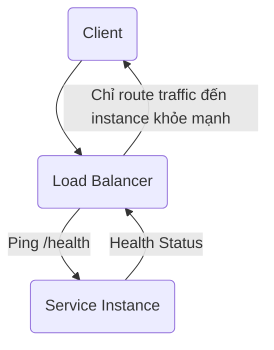
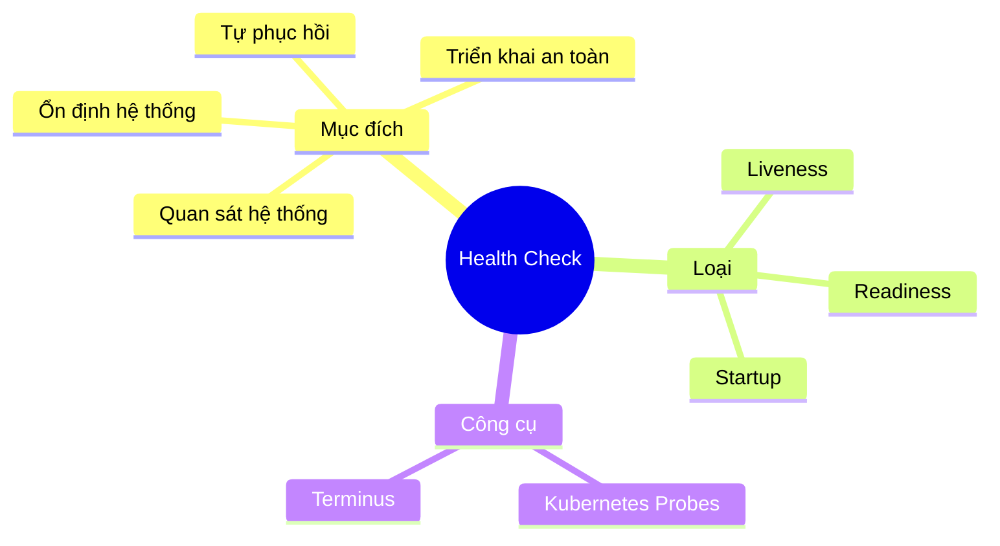

# Lesson: Health Check trong Microservices

## 1. Tổng quan


Health check là cơ chế giúp một microservice công bố trạng thái nội tại của nó để các thành phần khác trong hệ thống (load balancer, orchestrator, monitoring tool) biết dịch vụ đang **hoạt động tốt**, **suy giảm**, hay **gặp lỗi**.

Health check giúp đảm bảo:

- Hệ thống ổn định và sẵn sàng
- Tự phục hồi khi gặp lỗi
- Tăng khả năng quan sát (observability)
- Triển khai và scale dịch vụ an toàn

---

## 2. Tại sao Health Check lại quan trọng?

### ❗ 2.1 Phát hiện lỗi sớm

Không có health check, hệ thống chỉ phát hiện lỗi **sau khi request bắt đầu fail**. Health check chủ động phát hiện các vấn đề trước người dùng:

- Mất kết nối database
- Độ trễ message queue tăng cao
- Lỗi từ dịch vụ bên thứ 3
- Dịch vụ sử dụng quá nhiều bộ nhớ

### 🔄 2.2 Hỗ trợ cơ chế tự phục hồi

Kubernetes và nhiều hệ thống orchestration sử dụng health check để:

- Tự động restart service lỗi
- Loại instance lỗi khỏi load balancer
- Tự scale thêm instance khi cần

### 🚀 2.3 Đảm bảo triển khai an toàn

Các chiến lược như rolling update hoặc blue‑green deployment dựa vào health check để tránh gửi traffic vào instance chưa sẵn sàng.

### 📈 2.4 Cải thiện khả năng quan sát

Health check giúp hiển thị trạng thái các dependency để dễ debug sự cố.

---

## 3. Các loại Health Check

### ⚙️ **Liveness Check**

Kiểm tra xem service còn chạy hay không (nhưng chưa chắc đã sẵn sàng phục vụ).

- Phát hiện deadlock
- Restart container bị treo

### 🚦 **Readiness Check**

Kiểm tra xem service đã sẵn sàng nhận traffic chưa.

- Kiểm tra xem ứng dụng đã boot xong chưa
- Đợi database hoặc cache kết nối thành công

### 📡 **Startup Check**

Dùng cho các service khởi động chậm, tránh bị Kubernetes restart quá sớm.

---

## 4. Luồng Health Check (Diagram)



---

## 5. Ví dụ thực tế: Health Check trong NestJS Microservice

### Endpoint đơn giản `/health`

```ts
@Controller('health')
export class HealthController {
  @Get()
  check() {
    return {
      status: 'ok',
      uptime: process.uptime(),
      timestamp: Date.now(),
    };
  }
}
```

### Health check nâng cao với `@nestjs/terminus`

```ts
@Controller('health')
export class HealthController {
  constructor(private health: HealthCheckService, private db: TypeOrmHealthIndicator) {}

  @Get()
  @HealthCheck()
  check() {
    return this.health.check([() => this.db.pingCheck('database')]);
  }
}
```

### Ví dụ response

```json
{
  "status": "ok",
  "info": {
    "database": { "status": "up" }
  },
  "timestamp": 1734080000
}
```

---

## 6. Tích hợp với Kubernetes

### Cấu hình readiness & liveness probe

```yaml
livenessProbe:
  httpGet:
    path: /health
    port: 3000
  initialDelaySeconds: 10
  periodSeconds: 5

readinessProbe:
  httpGet:
    path: /health
    port: 3000
  initialDelaySeconds: 5
  periodSeconds: 5
```

---

## 7. Best Practices

- Health check phải **nhẹ, nhanh**
- Không thực thi logic nặng hoặc truy vấn phức tạp
- Kiểm tra trạng thái dependency (DB, cache, message broker)
- Tách rõ liveness và readiness endpoint
- Response dạng JSON dễ đọc và dễ phân tích
- Bảo vệ health check nâng cao nếu chứa thông tin nhạy cảm

---

## 8. Diagram tổng hợp



---

## 9. Kết luận

Health check là nền tảng quan trọng cho bất kỳ hệ thống microservices nào. Nó giúp hệ thống tự động phát hiện lỗi, tự phục hồi, scale đúng thời điểm và giữ mức độ sẵn sàng cao.

> Một microservice không có health check giống như một "hộp đen" — hãy thêm health check để giúp hệ thống trở nên minh bạch và đáng tin cậy hơn.
