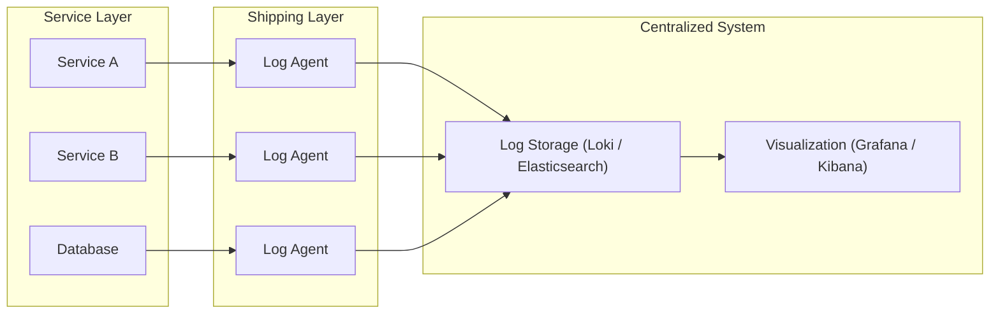

# Centralize Logging trong Microservices

## 1. Vấn đề của Logging truyền thống

Khi chuyển từ Monolithic sang Microservices, số lượng service tăng lên đáng kể. Mỗi service lại chạy trên một hoặc nhiều container/server khác nhau. Điều này dẫn đến các vấn đề nghiêm trọng với cách ghi log truyền thống (ghi ra file hoặc stdout console):

- **Phân tán:** Logs nằm rải rác ở khắp nơi. Để debug một lỗi, bạn phải SSH vào từng server hoặc dùng `docker logs` cho từng container.
- **Khó khăn trong việc trace lỗi:** Một request đi qua nhiều service (A -> B -> C). Nếu lỗi xảy ra ở C, làm sao bạn biết nó bắt nguồn từ request nào ở A?
- **Mất mát dữ liệu:** Nếu một container bị crash hoặc bị xóa đi, logs bên trong nó cũng biến mất theo (ephemeral storage).
- **Khó phân tích tổng thể:** Không thể thống kê được có bao nhiêu lỗi 500 xảy ra trên toàn hệ thống trong 1 giờ qua.

=> Chúng ta cần một giải pháp **Centralized Logging** (Tập trung log về một mối).

## 2. Centralized Logging là gì?

Centralized Logging là phương pháp thu thập logs từ tất cả các nguồn (containers, services, infrastructure) và đẩy về một kho lưu trữ tập trung. Tại đó, logs được đánh chỉ mục (index), cho phép tìm kiếm, lọc, và trực quan hóa.

### Mô hình hoạt động

## 3. Lợi ích cốt lõi

1.  **Single Pane of Glass:** Xem logs của toàn bộ hệ thống tại một nơi duy nhất.
2.  **Correlation & Tracing:** Dễ dàng lọc logs theo `RequestID` hoặc `TraceID` để xem trọn vẹn hành trình của một request.
3.  **Persistence:** Logs được lưu trữ an toàn ngay cả khi container sinh ra nó đã bị xóa.
4.  **Actionable Insights:** Từ logs có thể tạo ra các dashboard để theo dõi sức khỏe hệ thống (ví dụ: đếm số lượng log `level=error`).

## 4. Các giải pháp phổ biến

### ELK Stack (Elasticsearch - Logstash - Kibana)

- **Ưu điểm:** Rất mạnh mẽ, phổ biến lâu đời, khả năng full-text search tuyệt vời.
- **Nhược điểm:** Tốn tài nguyên (Java-based), cấu hình phức tạp, chi phí vận hành cao cho cluster Elasticsearch.

### EFK Stack (Elasticsearch - Fluentd - Kibana)

- Tương tự ELK nhưng thay Logstash bằng Fluentd (nhẹ hơn, viết bằng Ruby/C).

### PLG Stack (Promtail - Loki - Grafana)

- **Promtail:** Agent thu thập log (tương tự như Prometheus node exporter).
- **Loki:** Nơi lưu trữ log. Điểm khác biệt lớn nhất là Loki **không index toàn bộ text** của log, mà chỉ index **metadata (labels)**. Điều này giúp Loki cực kỳ nhẹ và rẻ.
- **Grafana:** Giao diện hiển thị.
- **Ưu điểm:** Tối ưu cho môi trường Cloud Native/Kubernetes, chi phí thấp, tích hợp mượt mà với Grafana (nơi thường đã có sẵn metrics).

> Trong khoá học này, chúng ta sẽ sử dụng **PLG Stack** vì tính hiệu quả và sự phổ biến của nó trong hệ sinh thái hiện đại.
