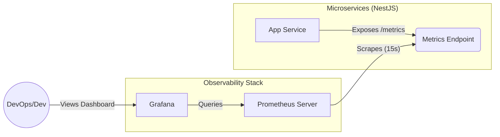

# 📊 Monitoring Metrics Với Prometheus Trong Microservices


## 1. Lý Thuyết Cơ Bản

### 🟢 Metrics là gì?

Metrics là các số liệu định lượng về hoạt động của hệ thống tại một thời điểm cụ thể. Chúng giúp trả lời các câu hỏi như:

- Hệ thống đang xử lý bao nhiêu request/giây?
- Thời gian phản hồi trung bình là bao nhiêu?
- CPU và RAM đang sử dụng bao nhiêu?
- Có bao nhiêu lỗi 500 xảy ra trong 5 phút qua?

### 🔥 Prometheus là gì?

**Prometheus** là một hệ thống giám sát và cảnh báo mã nguồn mở (Open Source), được thiết kế đặc biệt cho kiến trúc Microservices.

**Đặc điểm nổi bật:**

- **Pull Model:** Prometheus chủ động "kéo" (scrape) dữ liệu từ các service thay vì đợi service gửi dữ liệu đến (Push).
- **Time Series Database:** Lưu trữ dữ liệu dạng chuỗi thời gian cực kỳ hiệu quả.
- **PromQL:** Ngôn ngữ truy vấn mạnh mẽ để phân tích và tổng hợp metrics.

### 4 Loại Metric Cơ Bản

1. **Counter:** Số đếm tăng dần (ví dụ: _Tổng số request http_, _Tổng số đơn hàng_). Không bao giờ giảm (trừ khi restart).
2. **Gauge:** Giá trị có thể tăng hoặc giảm (ví dụ: _Số lượng goroutine/thread đang chạy_, _RAM usage_).
3. **Histogram:** Đo lường phân phối các giá trị (ví dụ: _Thời gian xử lý request_ - 95% request dưới 0.5s).
4. **Summary:** Tương tự Histogram nhưng tính toán phân vị (quantiles) ngay tại phía client.

---

## 2. Kiến Trúc & Diagram

Trong hệ thống E-Invoice của chúng ta, luồng dữ liệu metrics hoạt động như sau:



### Giải thích luồng hoạt động:

1. **Source (NestJS App):** Sử dụng thư viện `@willsoto/nestjs-prometheus` để thu thập và tính toán metrics bên trong ứng dụng.
2. **Expose:** Ứng dụng mở một endpoint (thường là `/metrics`) để hiển thị dữ liệu dạng text format của Prometheus.
3. **Collection (Prometheus):** Server Prometheus (chạy trong Docker) định kỳ (mỗi 15s) gọi vào endpoint `/metrics` để lấy dữ liệu về lưu trữ.
4. **Visualization (Grafana):** Grafana kết nối tới Prometheus để vẽ biểu đồ và tạo dashboard.

---

## 3. Use Case Thực Tế (E-Invoice Project)

### 3.1. Cấu hình phía Ứng dụng (Codebase)

Chúng ta đang sử dụng module `MetricsModule` tại `libs/observability`.

**File:** `libs/observability/src/lib/metrics/metrics.module.ts`

```typescript
// libs/observability/src/lib/metrics/metrics.module.ts
import { Module } from '@nestjs/common';
import { PrometheusModule } from '@willsoto/nestjs-prometheus';

@Module({
  imports: [
    PrometheusModule.register({
      path: '/metrics', // Endpoint để Prometheus scrape
      defaultMetrics: {
        enabled: true, // Tự động thu thập metrics chuẩn của Node.js (CPU, Event Loop, GC...)
      },
    }),
  ],
  exports: [PrometheusModule],
})
export class MetricsModule {}
```

Use case ở đây là tự động thu thập **Default Metrics** (CPU, Memory, Process usage) mà không cần code thêm gì nhiều.

### 3.2. Cấu hình Infrastructure (Docker)

**File:** `docker/prometheus.yml`
Đây là nơi cấu hình Prometheus để biết cần lấy dữ liệu ở đâu.

```yaml
global:
  scrape_interval: 15s # Chu kỳ lấy dữ liệu (15 giây 1 lần)

scrape_configs:
  - job_name: 'nestjs-app'
    metrics_path: /api/v1/metrics # Đường dẫn API trong codebase thực tế
    static_configs:
      # host.docker.internal giúp container Prometheus nhìn thấy ứng dụng chạy trên máy host
      - targets: ['host.docker.internal:3300']
```

### 3.3. Kết quả (Simulation)

Khi hệ thống chạy, endpoint `/metrics` sẽ trả về dữ liệu dạng như sau:

```text
# HELP process_cpu_user_seconds_total Total user CPU time spent in seconds.
# TYPE process_cpu_user_seconds_total counter
process_cpu_user_seconds_total 0.45

# HELP process_resident_memory_bytes Resident memory size in bytes.
# TYPE process_resident_memory_bytes gauge
process_resident_memory_bytes 56430592

# HELP nestjs_http_requests_total Total number of HTTP requests
# TYPE nestjs_http_requests_total counter
nestjs_http_requests_total{method="GET", status="200", path="/api/v1/invoices"} 15
```

### 3.4. Custom Metric (Ví dụ nâng cao)

Nếu muốn đo **_"Tổng số hóa đơn đã tạo"_**, ta có thể inject một `Counter` vào Service:

```typescript
// InvoiceService (Ví dụ minh họa)
import { Injectable } from '@nestjs/common';
import { Counter } from 'prom-client';
import { InjectMetric } from '@willsoto/nestjs-prometheus';

@Injectable()
export class InvoiceService {
  constructor(@InjectMetric('total_invoices_created') public counter: Counter<string>) {}

  createInvoice() {
    // Logic tạo hóa đơn...
    this.counter.inc(); // Tăng bộ đếm lên 1
  }
}
```

## 4. Tổng Kết

Việc tích hợp Prometheus giúp chúng ta chuyển từ trạng thái "Mù thông tin" sang "Nắm rõ sức khỏe hệ thống".

- **Hạ tầng:** Dựa vào `docker-compose.provider.yaml` để dựng Prometheus/Grafana.
- **Ứng dụng:** Dựa vào `MetricsModule` để expose dữ liệu.
- **Vận hành:** Dùng Grafana Dashboard để theo dõi và `AlertManager` để cảnh báo khi có sự cố.

---

## 5. Grafana Dashboard Template

Để hiển thị Metrics lên Grafana một cách trực quan, bạn có thể Import dashboard mẫu có sẵn thay vì vẽ lại từ đầu.

### 5.1. Import Dashboard

1. Truy cập Grafana: `http://localhost:3000` (User/Pass: `admin`/`admin`).
2. Chọn **Dashboards** -> **New** -> **Import**.
3. Nhập ID hoặc Paste JSON của Dashboard.

### 5.2. Recommended Dashboards (NestJS/NodeJS)

**Option 1: NodeJS Application Dashboard (ID: 11158)**
Đây là dashboard phổ biến nhất cho metrics của Node.js (sử dụng thư viện `prom-client` mặc định của NestJS).

- **ID:** `11158`
- **Link:** [NodeJS Dashboard 11158](https://grafana.com/grafana/dashboards/11158-nodejs-application-dashboard/)
- **Metrics hiển thị:**
  - Process Memory Usage (RAM)
  - CPU Usage
  - Event Loop Lag
  - Active Handles/Requests
  - Garbage Collection stats

**Option 2: NestJS Custom Dashboard (Example)**
Nếu bạn muốn theo dõi chi tiết HTTP Request cho ứng dụng NestJS của mình, có thể sử dụng template JSON đơn giản dưới đây.

<details>
<summary><b>🔥 Click để xem JSON Model cho Panel mẫu</b></summary>

```json
{
  "title": "Requests Rate (1m)",
  "type": "timeseries",
  "gridPos": { "h": 8, "w": 12, "x": 0, "y": 0 },
  "targets": [
    {
      "datasource": { "type": "prometheus", "uid": "YOUR_DATASOURCE_UID" },
      "expr": "rate(nestjs_http_requests_total[1m])",
      "legendFormat": "{{method}} {{status}}",
      "refId": "A"
    }
  ]
}
```

**Giải thích Query:**

- `rate(nestjs_http_requests_total[1m])`: Tính tốc độ request trung bình trong 1 phút vừa qua.
</details>

### 5.3. Tạo Dashboard Thủ Công (Step-by-step)

1. **Add new Visualization**: Chọn DataSource là `Prometheus`.
2. **Query**: Nhập `process_cpu_user_seconds_total` để xem CPU.
3. **Query**: Nhập `process_resident_memory_bytes` để xem RAM.
4. **Apply** và Save Dashboard.
