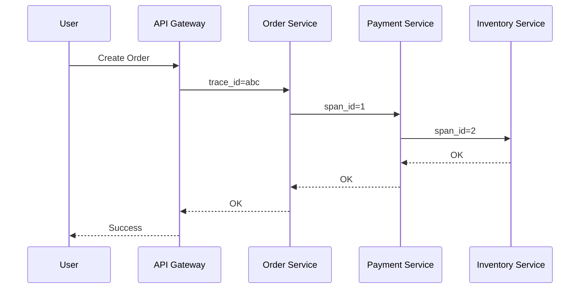

# 🔍 Distributed Tracing trong Microservices 
---


## 🎯 Mục tiêu bài học

Sau lesson này, bạn sẽ:

* Hiểu **bản chất thật sự** của Distributed Tracing (DT) – không dừng ở công cụ
* Biết **khi nào cần tracing, khi nào KHÔNG**
* Thiết kế hệ thống tracing **đúng ngay từ đầu** cho Microservices
* Tránh các **anti-pattern nguy hiểm trong production**

---

## 1️⃣ Giới thiệu vấn đề

### ❓ Vì sao Distributed Tracing quan trọng trong thực tế?

Trong Microservices:

* 1 request của user **không còn nằm trong 1 service**
* Nó có thể đi qua:

  * API Gateway
  * Auth Service
  * Order Service
  * Payment Service
  * Inventory Service
 


 


👉 Khi lỗi xảy ra, câu hỏi thực tế là:

* ❌ Service nào chậm?
* ❌ Gọi downstream nào gây timeout?
* ❌ Lỗi xuất hiện ở đâu, bao lâu, bao nhiêu lần?

🔥 **Log đơn lẻ không trả lời được các câu hỏi này**.

---

### ⚠️ Những sai lầm / hiểu lầm phổ biến

* ❌ *"Có log là đủ rồi"*
* ❌ *"Distributed tracing = log nâng cao"*
* ❌ *"Cài Jaeger / Zipkin là xong"*
* ❌ Trace mọi request 100% (→ hệ thống chết vì overhead)

💡 **Tracing là 1 bài toán system design, không phải cài tool**.

---

## 2️⃣ Kiến thức cốt lõi (Core Concepts)

### 🧠 Distributed Tracing là gì? (Bản chất)

> Distributed Tracing giúp bạn **theo dõi toàn bộ hành trình của 1 request** xuyên qua nhiều service, process, network boundary.

📌 Tracing trả lời:

* Request đi qua **những service nào?**
* Mỗi step **mất bao lâu?**
* Lỗi xảy ra **ở span nào?**

---

### 🔗 Trace – Span – Context (3 khái niệm sống còn)


#### 1️⃣ Trace

* Đại diện cho **1 request end-to-end**
* Có `trace_id` duy nhất

#### 2️⃣ Span

* Một **đơn vị công việc nhỏ** trong trace
* Ví dụ:

  * HTTP call
  * DB query
  * External API call

#### 3️⃣ Context Propagation

* Cách `trace_id` & `span_id` được **truyền qua service khác**
* Thường qua:

  * HTTP headers
  * Message metadata (Kafka, RabbitMQ)

⚠️ **Không có context propagation → tracing vô nghĩa**

---

### 📐 Tracing nhìn dưới góc System Design

Distributed tracing giải quyết 3 bài toán:

| Bài toán            | Nếu không có tracing       |
| ------------------- | -------------------------- |
| Latency analysis    | Đoán mò                    |
| Root cause analysis | Đọc log thủ công           |
| Dependency mapping  | Vẽ tay / tài liệu lỗi thời |

---

### 🔄 So sánh các cách tiếp cận


#### 🧱 Log-based debugging

✅ Dễ implement
❌ Không thấy flow tổng thể
❌ Không đo được latency chain

#### 📈 Metrics-based monitoring

✅ Tốt cho alert
❌ Không thấy chi tiết từng request

#### 🔍 Distributed Tracing

✅ Thấy full request flow
✅ Phân tích performance chính xác
❌ Overhead nếu dùng sai

💡 **Best practice: Logs + Metrics + Tracing (Observability Stack)**

---

### 🚦 Khi nào NÊN / KHÔNG NÊN dùng Distributed Tracing

#### ✅ NÊN dùng khi:

* Microservices > 3 services
* Có async communication
* Performance issue khó debug
* Team > 5 dev

#### ❌ KHÔNG nên (hoặc chưa cần):

* Monolith nhỏ
* CRUD app đơn giản
* Không có năng lực vận hành tracing system

---

## 3️⃣ Ví dụ thực tế (Enterprise-like)

### 🏢 Case study: Hệ thống E-commerce

**Flow đặt hàng:**

1. API Gateway
2. Order Service
3. Payment Service
4. Inventory Service
5. Notification Service


---

### 🧩 Mô phỏng kiến trúc (Tracing Flow)



👉 Khi Payment chậm → nhìn trace là biết ngay.

---

### 🧪 Pseudo-code (Context Propagation)

```ts
// Express / NestJS middleware
function tracingMiddleware(req, res, next) {
  const traceId = req.headers['x-trace-id'] || generateTraceId();
  req.traceId = traceId;
  next();
}
```

⚠️ Thiếu middleware này → tracing đứt gãy.

---

## 4️⃣ Best Practices & Anti-patterns

### ✅ Best Practices

* 🔹 **Sampling** (1–10%) thay vì trace 100%
* 🔹 Đặt span name có ý nghĩa ("POST /orders")
* 🔹 Trace boundary quan trọng (DB, external API)
* 🔹 Đồng bộ traceId với log
* 🔹 Centralized tracing backend (Jaeger, Tempo, etc.)

---

### 🚫 Anti-patterns nguy hiểm

* ❌ Trace tất cả mọi thứ
* ❌ Span quá nhỏ → noise
* ❌ Không propagate context async
* ❌ Gắn tracing logic cứng vào business code

🔥 **Tracing sai → tốn tiền, chậm hệ thống, không debug được**

---

## 5️⃣ Summary & Key Takeaways

### 🧠 Tóm tắt nhanh

* Distributed tracing = nhìn **end-to-end request**
* Không phải tool, mà là **tư duy thiết kế hệ thống**
* Phải đi kèm logs & metrics

---

### ✅ Checklist ghi nhớ

* [ ] Hiểu rõ Trace / Span / Context
* [ ] Có chiến lược sampling
* [ ] Propagate context đầy đủ
* [ ] Trace đúng chỗ, không trace bừa
* [ ] Dùng tracing để cải thiện design, không chỉ debug

---

🎓 **Nếu bạn hiểu và dùng tracing đúng cách, bạn sẽ debug như Senior, không phải đọc log như Junior.**

🚀 Ready để mở rộng lesson này sang:

* OpenTelemetry
* Jaeger vs Tempo
* Tracing cho Kafka / Event-driven
* Tracing trong Serverless
