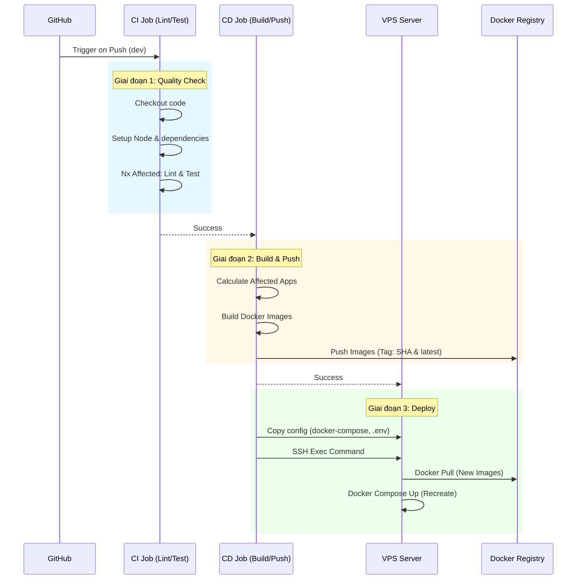

# Hướng Dẫn Chi Tiết: CI/CD Deployment on VPS

Tài liệu này đi sâu vào quy trình tự động hóa triển khai (CI/CD) sử dụng GitHub Actions để deploy ứng dụng lên VPS (Virtual Private Server).

## 1. Tổng Quan Quy Trình CI/CD

Quy trình được định nghĩa trong file `.github/workflows/deploy.yml`. Mục tiêu là mỗi khi code được push lên nhánh `dev`, hệ thống sẽ tự động build, test và update phiên bản mới lên server.

### Pipeline Flow Diagram



## 2. Chi Tiết Các Bước Trong Workflow

### Giai Đoạn 1: CI (Continuous Integration)

Chạy trên máy ảo `ubuntu-latest` của GitHub.

- **Nx Affected**: Điểm đặc biệt của Monorepo. Thay vì test toàn bộ dự án (tốn thời gian), Nx phân tích dependency graph để chỉ chạy test những app/lib bị ảnh hưởng bởi commit mới.
- `nx affected -t lint`: Kiểm tra lỗi cú pháp.
- `nx affected -t test`: Chạy unit test.

### Giai Đoạn 2: Build & Push Docker Images

- Sử dụng script `tools/deploy/build-images.sh`.
- **Image Tagging**: Mỗi lần build sẽ tạo 2 tags:
  1.  `latest`: Để luôn lấy bản mới nhất mặc định.
  2.  `github.sha` (Commit Hash): Để versioning cụ thể, giúp dễ dàng rollback nếu cần.
- **Secrets Security**: Username/Password của Docker Registry được lưu trong GitHub Secrets, không lộ ra ngoài.

### Giai Đoạn 3: Deploy to VPS

Sử dụng `appleboy/ssh-action` để kết nối SSH an toàn vào VPS.

#### Các thiết lập cần có trên GitHub Secrets:

- `SSH_HOST`: IP Address của VPS.
- `SSH_USER`: Username (thường là root hoặc user sudoer).
- `SSH_PRIVATE_KEY`: Private Key để authentication (không dùng mật khẩu text).
- `ENV_FILE`: Nội dung file `.env` production.
- `DOCKER_REGISTRY`, `DOCKER_USERNAME`, `DOCKER_PASSWORD`: Thông tin repo chứa ảnh.

#### Lệnh thực thi trên VPS:

```bash
# 1. Di chuyển vào thư mục app
cd ~/app/einvoice

# 2. Đảm bảo các service nền tảng (redis, db...) luôn chạy
docker compose -f docker-compose.provider.yaml up -d redis

# 3. Pull image mới nhất về (chỉ pull service cần update - bff)
docker compose -f docker-compose.deploy.yml pull bff

# 4. Recreate container với image mới (Zero downtime deployment strategies có thể áp dụng sau)
docker compose -f docker-compose.deploy.yml up -d --no-deps bff
```

## 3. Cấu Hình VPS (Server Setup)

Để pipeline chạy thành công, VPS cần được chuẩn bị trước 1 lần duy nhất:

1.  **Cài đặt Docker & Docker Compose**:
    ```bash
    curl -fsSL https://get.docker.com -o get-docker.sh
    sh get-docker.sh
    ```
2.  **Tạo thư mục dự án**:
    ```bash
    mkdir -p ~/app/einvoice
    ```
3.  **Setup SSH Key**:
    - Tạo cặp key trên máy local: `ssh-keygen -t rsa`.
    - Copy nội dung Public Key (`id_rsa.pub`) vào file `~/.ssh/authorized_keys` trên VPS.
    - Copy nội dung Private Key (`id_rsa`) vào GitHub Secret `SSH_PRIVATE_KEY`.

## 4. Xử Lý Sự Cố (Troubleshooting)

### Lỗi: "Permission denied (publickey)"

- Nguyên nhân: Sai SSH Key hoặc chưa add public key vào VPS.
- Khắc phục: Kiểm tra lại `~/.ssh/authorized_keys` và quyền file (chmod 600).

### Lỗi: "No such file or directory"

- Nguyên nhân: Thư mục `~/app/einvoice` chưa tồn tại.
- Khắc phục: SSH vào VPS và tạo thủ công, hoặc thêm lệnh `mkdir -p` vào workflow bước đầu tiên.

### Lỗi: "No space left on device"

- Nguyên nhân: Docker images cũ chiếm hết dung lượng.
- Khắc phục: Chạy `docker system prune -a` định kỳ trên VPS để dọn dẹp.

## 5. Kết Luận

Quy trình này giúp team **"Ship fast, ship confident"**. Mọi thay đổi code đều được kiểm chứng và update tự động, loại bỏ thao tác thủ công dễ sai sót (SSH vào server gõ lệnh pull/up).
