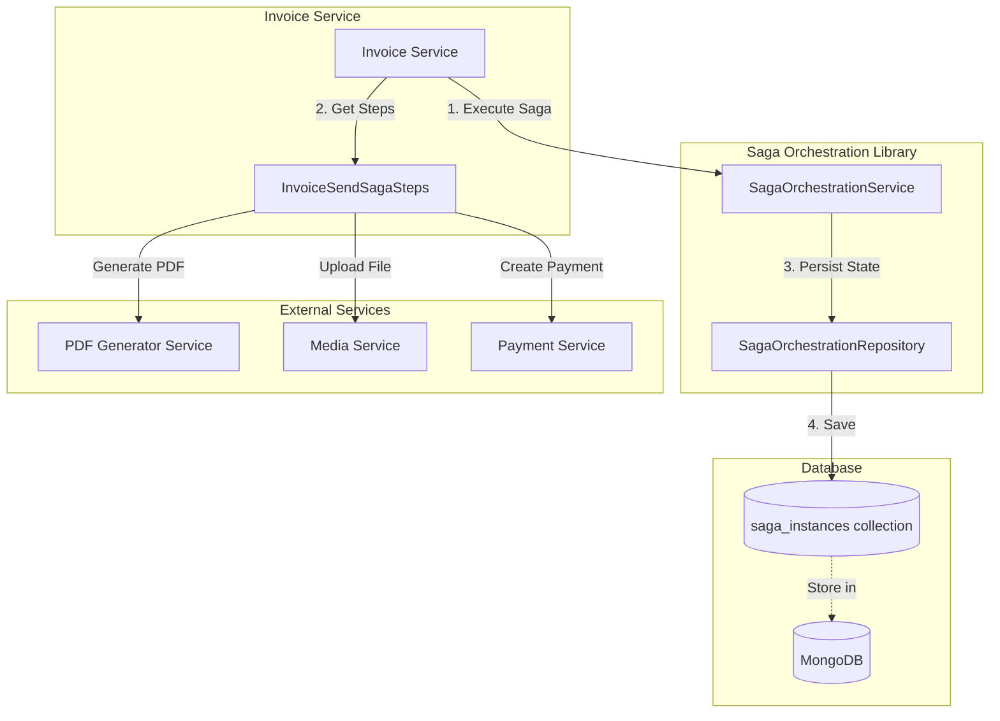
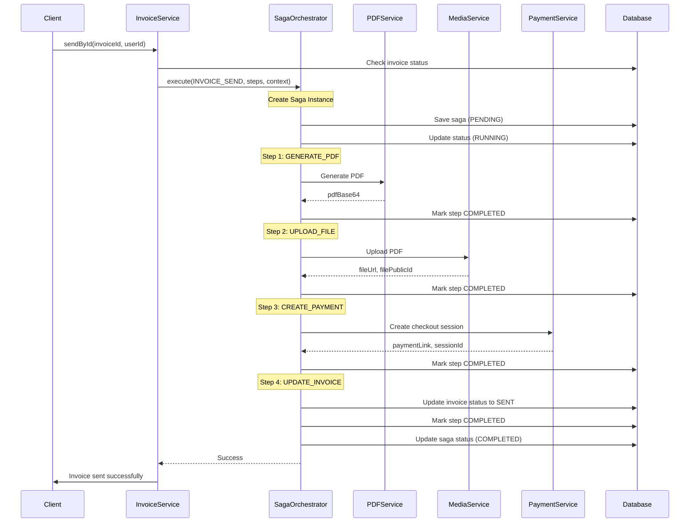
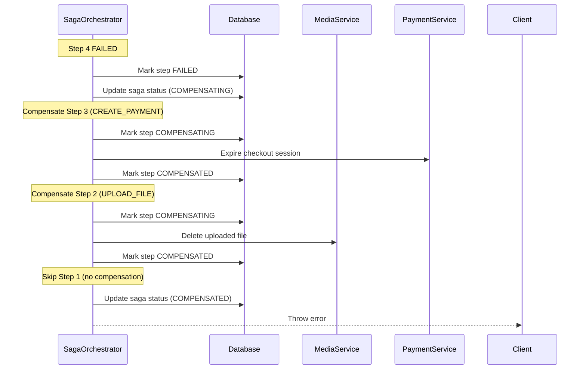

# Distributed Transactions với Saga Orchestration

## Tổng quan

Dự án E-Invoice Backend sử dụng **Saga Orchestration Pattern** để quản lý các distributed transactions phức tạp trên nhiều microservices. Pattern này đảm bảo tính nhất quán dữ liệu (data consistency) mà không cần dùng 2-Phase Commit (2PC), phù hợp với kiến trúc microservices.

## Saga Pattern là gì?

Saga Pattern là một design pattern để quản lý distributed transactions bằng cách chia một transaction lớn thành một chuỗi các transactions nhỏ hơn (steps). Mỗi step có thể thực thi và commit độc lập. Nếu một step thất bại, Saga sẽ thực hiện các **compensation transactions** (compensating actions) để hoàn tác các thay đổi đã thực hiện ở các steps trước đó.

### Saga Orchestration vs Saga Choreography

| Đặc điểm       | Saga Orchestration                               | Saga Choreography                                       |
| -------------- | ------------------------------------------------ | ------------------------------------------------------- |
| **Điều phối**  | Centralized orchestrator điều khiển toàn bộ flow | Decentralized, mỗi service tự quyết định bước tiếp theo |
| **Phức tạp**   | Dễ hiểu, dễ debug                                | Phức tạp hơn, khó debug                                 |
| **Coupling**   | Tight coupling với orchestrator                  | Loose coupling                                          |
| **Monitoring** | Dễ dàng theo dõi trạng thái                      | Khó theo dõi transaction state                          |
| **Sử dụng**    | Phù hợp cho business flows phức tạp              | Phù hợp cho event-driven simple flows                   |

**Dự án này sử dụng Saga Orchestration** vì nó phù hợp với use case gửi invoice có nhiều bước phụ thuộc lẫn nhau.

## Kiến trúc Saga Orchestration trong Dự án



### Các thành phần chính

#### 1. Saga Interfaces

**File:** [saga-step.interface.ts](file:///Users/tanthanh/Documents/Project/einvoice-backend/libs/interfaces/src/lib/saga/saga-step.interface.ts)

Định nghĩa các interface cơ bản cho Saga pattern:

```typescript
// Kết quả của mỗi step
export interface SagaStepResult {
  success: boolean;
  data?: any;
  error?: string;
}

// Định nghĩa một step trong saga
export interface SagaStep<TContext = any> {
  name: string;
  execute: (context: TContext) => Promise<SagaStepResult>;
  compensate?: (context: TContext) => Promise<void>;
}

// Context chung cho saga
export interface SagaContext {
  sagaId: string;
  [key: string]: any;
}

// Context cụ thể cho Invoice Send Saga
export interface InvoiceSendSagaContext extends SagaContext {
  invoiceId: string;
  userId: string;
  processId: string;
  // Step results
  pdfBase64?: string;
  fileUrl?: string;
  filePublicId?: string;
  paymentLink?: string;
  sessionId?: string;
}
```

#### 2. Saga Schema

**File:** [saga.schema.ts](file:///Users/tanthanh/Documents/Project/einvoice-backend/libs/schemas/src/lib/saga.schema.ts)

MongoDB schema để lưu trữ trạng thái của saga instances:

```typescript
export class SagaInstance extends BaseSchema {
  @Prop({ type: String, enum: SAGA_TYPE, required: true })
  sagaType: SAGA_TYPE;

  @Prop({ type: String, enum: SAGA_STATUS, default: SAGA_STATUS.PENDING })
  status: SAGA_STATUS;

  @Prop({ type: Number, default: 0 })
  currentStep: number;

  @Prop({ type: [SagaStepData], default: [] })
  steps: SagaStepData[];

  @Prop({ type: Object, required: true })
  context: Record<string, any>;

  @Prop({ type: String })
  error?: string;
}
```

#### 3. Saga Enums

**File:** [saga.enum.ts](file:///Users/tanthanh/Documents/Project/einvoice-backend/libs/constants/src/lib/enum/saga.enum.ts)

```typescript
export enum SAGA_STATUS {
  PENDING = 'PENDING',
  RUNNING = 'RUNNING',
  COMPLETED = 'COMPLETED',
  FAILED = 'FAILED',
  COMPENSATING = 'COMPENSATING',
  COMPENSATED = 'COMPENSATED',
}

export enum SAGA_STEP_STATUS {
  PENDING = 'PENDING',
  RUNNING = 'RUNNING',
  COMPLETED = 'COMPLETED',
  FAILED = 'FAILED',
  COMPENSATING = 'COMPENSATING',
  COMPENSATED = 'COMPENSATED',
}

export enum SAGA_TYPE {
  INVOICE_SEND = 'INVOICE_SEND',
}
```

#### 4. Saga Orchestration Service

**File:** [saga-orchestration.service.ts](file:///Users/tanthanh/Documents/Project/einvoice-backend/libs/saga-orchestration/src/lib/saga-orchestration.service.ts)

Service core điều phối việc thực thi saga:

**Chức năng chính:**

- **Execute saga**: Thực thi tuần tự các steps
- **Manage state**: Cập nhật trạng thái của saga và từng step
- **Handle failures**: Tự động trigger compensation khi có lỗi
- **Compensation**: Rollback các steps đã thực hiện thành công theo thứ tự ngược lại

#### 5. Saga Orchestration Repository

**File:** [saga-orchestration.repository.ts](file:///Users/tanthanh/Documents/Project/einvoice-backend/libs/saga-orchestration/src/lib/saga-orchestration.repository.ts)

Repository để tương tác với MongoDB, lưu trữ và cập nhật trạng thái saga:

**Các method chính:**

- `create()`: Tạo saga instance mới
- `updateStatus()`: Cập nhật status của saga
- `updateCurrentStep()`: Cập nhật step hiện tại
- `markStepRunning()`, `markStepCompleted()`, `markStepFailed()`: Quản lý trạng thái step
- `markStepCompensating()`, `markStepCompensated()`: Quản lý compensation

## Use Case: Invoice Send Saga

### Tổng quan Flow

Flow gửi invoice bao gồm 4 bước chính và có compensation cho mỗi bước khi cần thiết.



### Các Steps trong Invoice Send Saga

**File:** [invoice-send-saga-steps.service.ts](file:///Users/tanthanh/Documents/Project/einvoice-backend/apps/invoice/src/app/modules/invoice/sagas/invoice-send-saga-steps.service.ts)

#### Step 1: GENERATE_PDF

**Chức năng:** Tạo file PDF từ invoice data

```typescript
{
  name: 'GENERATE_PDF',
  execute: async (context: InvoiceSendSagaContext): Promise<SagaStepResult> => {
    // Call PDF Generator Service
    const pdfBase64 = await this.pdfGeneratorClient.send(...);
    return {
      success: true,
      data: { pdfBase64 },
    };
  },
  // No compensation needed - PDF generation is idempotent
}
```

**Compensation:** Không cần (idempotent operation)

#### Step 2: UPLOAD_FILE

**Chức năng:** Upload PDF file lên Media Service (Cloudinary)

```typescript
{
  name: 'UPLOAD_FILE',
  execute: async (context: InvoiceSendSagaContext): Promise<SagaStepResult> => {
    const result = await this.mediaClient.send(UPLOAD_FILE, {
      fileBase64: context.pdfBase64,
      fileName: `invoice-${context.invoiceId}`,
    });

    return {
      success: true,
      data: { fileUrl: result.url, filePublicId: result.publicId },
    };
  },
  compensate: async (context: InvoiceSendSagaContext): Promise<void> => {
    // Delete uploaded file from Cloudinary
    await this.mediaClient.send(DESTROY_FILE, context.filePublicId);
  },
}
```

**Compensation:** Xóa file đã upload từ Cloudinary

#### Step 3: CREATE_PAYMENT

**Chức năng:** Tạo payment checkout session (Stripe)

```typescript
{
  name: 'CREATE_PAYMENT',
  execute: async (context: InvoiceSendSagaContext): Promise<SagaStepResult> => {
    const checkoutData = await this.paymentService.createCheckoutSession(...);

    return {
      success: true,
      data: {
        paymentLink: checkoutData.url,
        sessionId: checkoutData.sessionId
      },
    };
  },
  compensate: async (context: InvoiceSendSagaContext): Promise<void> => {
    // Expire checkout session
    await this.paymentService.expireCheckoutSession(context.sessionId);
  },
}
```

**Compensation:** Hủy payment session đã tạo

#### Step 4: UPDATE_INVOICE

**Chức năng:** Cập nhật invoice status thành SENT

```typescript
{
  name: 'UPDATE_INVOICE',
  execute: async (context: InvoiceSendSagaContext): Promise<SagaStepResult> => {
    await this.invoiceRepository.updateById(context.invoiceId, {
      status: INVOICE_STATUS.SENT,
      supervisorId: new ObjectId(context.userId),
      fileUrl: context.fileUrl,
    });

    return { success: true };
  },
  compensate: async (context: InvoiceSendSagaContext): Promise<void> => {
    // Revert invoice status to CREATED
    await this.invoiceRepository.updateById(context.invoiceId, {
      status: INVOICE_STATUS.CREATED,
      supervisorId: null,
      fileUrl: null,
    });
  },
}
```

**Compensation:** Revert invoice status về CREATED

### Compensation Flow

Khi một step thất bại, saga orchestrator sẽ tự động trigger compensation:



**Đặc điểm:**

- Compensation chỉ được thực hiện cho các steps đã **COMPLETED** thành công
- Compensation được thực hiện theo **thứ tự ngược lại** (reverse order)
- Nếu một compensation thất bại, vẫn tiếp tục compensate các steps còn lại
- Saga status cuối cùng sẽ là **COMPENSATED**

## Sử dụng Saga trong Code

### 1. Định nghĩa các Steps

Tạo một service để định nghĩa các steps:

```typescript
@Injectable()
export class InvoiceSendSagaSteps {
  constructor(
    private readonly pdfGeneratorClient: TcpClient,
    private readonly mediaClient: TcpClient,
    private readonly paymentService: PaymentService,
    private readonly invoiceRepository: InvoiceRepository,
  ) {}

  getSteps(invoice: Invoice): SagaStep<InvoiceSendSagaContext>[] {
    return [
      { name: 'GENERATE_PDF', execute: ..., compensate: ... },
      { name: 'UPLOAD_FILE', execute: ..., compensate: ... },
      { name: 'CREATE_PAYMENT', execute: ..., compensate: ... },
      { name: 'UPDATE_INVOICE', execute: ..., compensate: ... },
    ];
  }
}
```

### 2. Thực thi Saga

Trong service, inject `SagaOrchestrationService` và execute saga:

```typescript
@Injectable()
export class InvoiceService {
  constructor(
    private readonly sagaOrchestrator: SagaOrchestrationService,
    private readonly sagaSteps: InvoiceSendSagaSteps,
  ) {}

  async sendById(params: SendInvoiceTcpReq, processId: string) {
    const { invoiceId, userId } = params;

    // Prepare context
    const context: InvoiceSendSagaContext = {
      sagaId: '',
      invoiceId,
      userId,
      processId,
    };

    // Get steps
    const steps = this.sagaSteps.getSteps(invoice);

    // Execute saga
    try {
      await this.sagaOrchestrator.execute(SAGA_TYPE.INVOICE_SEND, steps, context);

      // Success handling
      this.kafkaClient.emit('invoice-sent', {
        id: invoiceId,
        paymentLink: context.paymentLink,
      });
    } catch (error) {
      // Error handling
      this.logger.error(`Failed to send invoice: ${error.message}`);
      throw error;
    }
  }
}
```

### 3. Inject Module

Trong Module, import `SagaOrchestrationModule`:

```typescript
import { SagaOrchestrationModule } from '@common/saga-orchestration';

@Module({
  imports: [
    SagaOrchestrationModule,
    // ... other modules
  ],
  providers: [InvoiceService, InvoiceSendSagaSteps],
})
export class InvoiceModule {}
```

## State Management

Mỗi saga instance được lưu vào MongoDB collection `saga_instances`:

```json
{
  "_id": "ObjectId",
  "sagaType": "INVOICE_SEND",
  "status": "COMPLETED",
  "currentStep": 3,
  "steps": [
    {
      "stepName": "GENERATE_PDF",
      "status": "COMPLETED",
      "startedAt": "2026-01-08T10:00:00Z",
      "completedAt": "2026-01-08T10:00:02Z",
      "data": { "pdfBase64": "..." }
    },
    {
      "stepName": "UPLOAD_FILE",
      "status": "COMPLETED",
      "startedAt": "2026-01-08T10:00:02Z",
      "completedAt": "2026-01-08T10:00:05Z",
      "data": {
        "fileUrl": "https://...",
        "filePublicId": "invoice_123"
      }
    },
    {
      "stepName": "CREATE_PAYMENT",
      "status": "COMPLETED",
      "startedAt": "2026-01-08T10:00:05Z",
      "completedAt": "2026-01-08T10:00:06Z",
      "data": {
        "paymentLink": "https://checkout.stripe.com/...",
        "sessionId": "cs_test_..."
      }
    },
    {
      "stepName": "UPDATE_INVOICE",
      "status": "COMPLETED",
      "startedAt": "2026-01-08T10:00:06Z",
      "completedAt": "2026-01-08T10:00:07Z"
    }
  ],
  "context": {
    "sagaId": "...",
    "invoiceId": "123",
    "userId": "456",
    "processId": "proc_789",
    "pdfBase64": "...",
    "fileUrl": "https://...",
    "filePublicId": "invoice_123",
    "paymentLink": "https://...",
    "sessionId": "cs_test_..."
  },
  "createdAt": "2026-01-08T10:00:00Z",
  "updatedAt": "2026-01-08T10:00:07Z"
}
```

## Best Practices

### 1. Idempotency

**Vấn đề:** Steps có thể được retry nhiều lần do network failures hoặc timeouts.

**Giải pháp:** Đảm bảo mỗi step là **idempotent** - thực hiện nhiều lần cho kết quả giống nhau:

```typescript
// Good: Idempotent - check trước khi upload
execute: async (context) => {
  // Check if file already exists
  const existingFile = await this.mediaService.findByFileName(fileName);
  if (existingFile) {
    return { success: true, data: existingFile };
  }

  // Upload only if not exists
  const result = await this.mediaService.upload(file);
  return { success: true, data: result };
};
```

### 2. Context Enrichment

Context được enriched sau mỗi step thành công:

```typescript
// Step 1 adds pdfBase64 to context
{ success: true, data: { pdfBase64: '...' } }

// Step 2 can use pdfBase64 from context
execute: async (context: InvoiceSendSagaContext) => {
  const pdfBase64 = context.pdfBase64; // Available from previous step
  // ...
}
```

### 3. Error Handling

Luôn catch và return error message rõ ràng:

```typescript
execute: async (context) => {
  try {
    const result = await this.externalService.call();
    return { success: true, data: result };
  } catch (error) {
    this.logger.error(`Step failed: ${error.message}`);
    return {
      success: false,
      error: error.message, // Clear error message
    };
  }
};
```

### 4. Compensation Safety

Compensation phải handle trường hợp data không tồn tại:

```typescript
compensate: async (context) => {
  try {
    // Check if resource exists before compensating
    if (context.filePublicId) {
      await this.mediaService.delete(context.filePublicId);
    }
  } catch (error) {
    // Log but don't throw - allow other compensations to continue
    this.logger.error(`Compensation failed: ${error.message}`);
  }
};
```

### 5. Logging

Log đầy đủ để dễ debug:

```typescript
this.logger.log(`Executing step ${stepIndex}: ${step.name} for saga ${sagaId}`);
this.logger.log(`Step ${step.name} completed for saga ${sagaId}`);
this.logger.error(`Step ${step.name} failed for saga ${sagaId}: ${errorMessage}`);
```

## Monitoring và Debugging

### 1. Kiểm tra trạng thái Saga

Query MongoDB để xem trạng thái của saga instances:

```javascript
// Find all failed sagas
db.saga_instances.find({ status: 'FAILED' });

// Find saga by type
db.saga_instances.find({ sagaType: 'INVOICE_SEND' });

// Find compensated sagas
db.saga_instances.find({ status: 'COMPENSATED' });
```

### 2. Debug một Saga cụ thể

```javascript
// Get saga by ID
db.saga_instances.findOne({ _id: ObjectId('...') });

// Check which step failed
db.saga_instances.findOne({ _id: ObjectId('...') }, { 'steps.stepName': 1, 'steps.status': 1, 'steps.error': 1 });
```

### 3. Logs

Saga orchestrator logs tất cả các events quan trọng:

```
[SagaOrchestrationService] Saga 507f1f77bcf86cd799439011 created for type INVOICE_SEND
[SagaOrchestrationService] Executing step 0: GENERATE_PDF for saga 507f1f77bcf86cd799439011
[SagaOrchestrationService] Step 0: GENERATE_PDF completed for saga 507f1f77bcf86cd799439011
[SagaOrchestrationService] Executing step 1: UPLOAD_FILE for saga 507f1f77bcf86cd799439011
...
```

## Limitations và Future Improvements

### Current Limitations

1. **No Retry Mechanism**: Khi một step thất bại, saga ngay lập tức bắt đầu compensation. Không có automatic retry.
2. **No Timeout Handling**: Không có timeout cho từng step.
3. **Sequential Execution Only**: Tất cả steps được thực thi tuần tự, không hỗ trợ parallel execution.
4. **No Saga Recovery**: Nếu orchestrator service crash giữa chừng, saga sẽ không tự động resume.

### Proposed Improvements

#### 1. Retry Mechanism

```typescript
interface SagaStep<TContext = any> {
  name: string;
  execute: (context: TContext) => Promise<SagaStepResult>;
  compensate?: (context: TContext) => Promise<void>;
  retryPolicy?: {
    maxRetries: number;
    retryDelayMs: number;
  };
}
```

#### 2. Timeout Support

```typescript
interface SagaStep<TContext = any> {
  name: string;
  execute: (context: TContext) => Promise<SagaStepResult>;
  compensate?: (context: TContext) => Promise<void>;
  timeoutMs?: number; // Step timeout
}
```

#### 3. Parallel Steps

```typescript
const steps = [
  { name: 'STEP_1', execute: ... },
  [
    { name: 'STEP_2A', execute: ... }, // Parallel
    { name: 'STEP_2B', execute: ... }, // Parallel
  ],
  { name: 'STEP_3', execute: ... },
];
```

#### 4. Saga Recovery

Implement background job để check và resume các saga instances bị stuck:

```typescript
@Cron('*/5 * * * *') // Every 5 minutes
async recoverStuckSagas() {
  const stuckSagas = await this.repository.findStuckSagas();

  for (const saga of stuckSagas) {
    await this.resumeSaga(saga);
  }
}
```

## Tham khảo

- [Saga Pattern - Microservices.io](https://microservices.io/patterns/data/saga.html)
- [Saga Orchestration vs Choreography](https://blog.couchbase.com/saga-pattern-implement-business-transactions-using-microservices-part/)
- [Distributed Transactions: The Saga Pattern](https://www.baeldung.com/cs/saga-pattern-microservices)

## Kết luận

Saga Orchestration pattern trong dự án E-Invoice Backend cung cấp một cách reliable và maintainable để quản lý distributed transactions. Pattern này đảm bảo:

- ✅ **Data Consistency**: Đảm bảo dữ liệu nhất quán qua nhiều services
- ✅ **Fault Tolerance**: Tự động rollback khi có lỗi
- ✅ **Observability**: Dễ dàng theo dõi trạng thái của transactions
- ✅ **Maintainability**: Code rõ ràng, dễ mở rộng thêm steps mới

Với implementation hiện tại, system có thể handle complex business flows một cách tin cậy và dễ debug.
