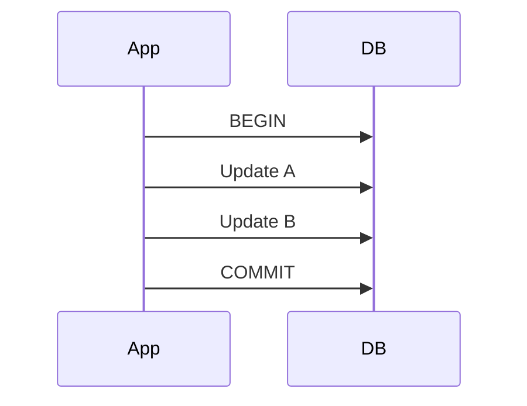
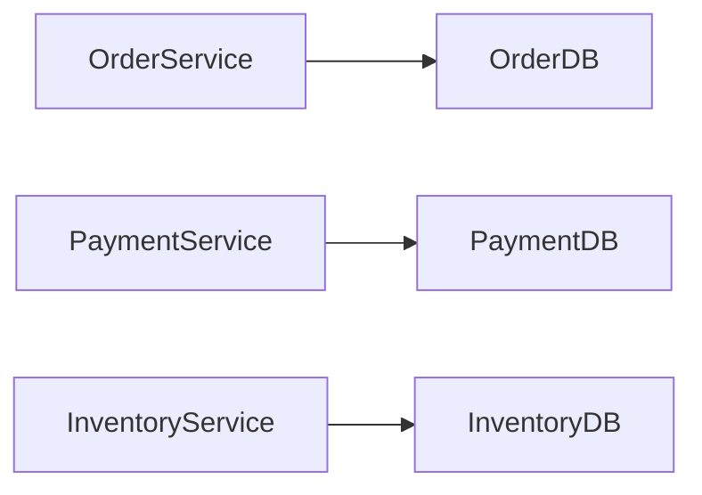
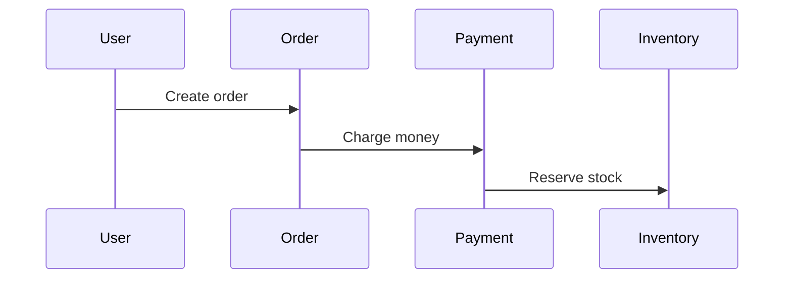
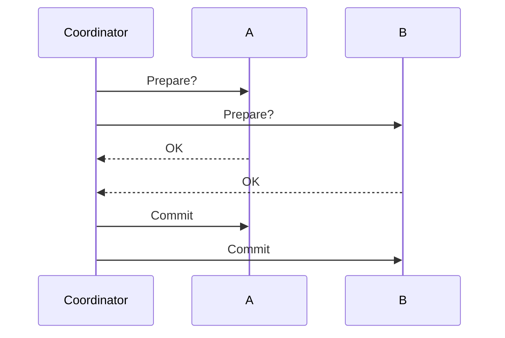
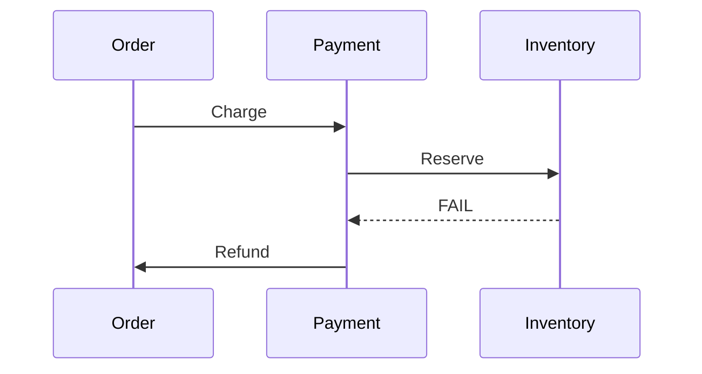
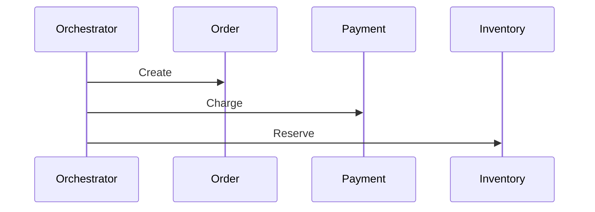
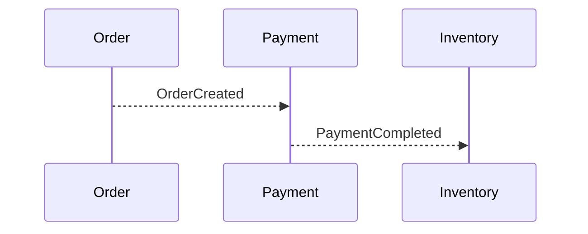

# Distributed Transaction trong Microservices


<br></br>

## 🎯 Mục tiêu

* Hiểu rõ **Transaction là gì** trong hệ thống phần mềm
* Hiểu vì sao **Distributed Transaction** trở thành vấn đề trong microservices
* Nắm các khái niệm cốt lõi (ACID, Eventual Consistency, Saga)
* Có nền tảng để tiếp cận các giải pháp nâng cao

---

## 1️⃣ Transaction là gì?

### 1.1 📌 Định nghĩa Transaction

**Transaction** là một đơn vị công việc (unit of work) gồm **một hoặc nhiều thao tác**, được thực thi như **một thể thống nhất**:

* ✅ Thành công → tất cả cùng được áp dụng
* ❌ Thất bại → tất cả bị hủy bỏ

**Ví dụ phổ biến**:

* 💰 Chuyển tiền ngân hàng
* 🛒 Đặt hàng và trừ tồn kho

---

### 1.2 🧱 ACID – Nền tảng của Transaction

Transaction trong hệ quản trị CSDL truyền thống tuân theo **ACID**:

* **A – Atomicity**: tất cả hoặc không có gì
* **C – Consistency**: dữ liệu luôn hợp lệ
* **I – Isolation**: các transaction không ảnh hưởng lẫn nhau
* **D – Durability**: dữ liệu được lưu vĩnh viễn sau commit

**Ví dụ (Monolith)**:

```
BEGIN TRANSACTION
  Debit account
  Credit account
COMMIT
```

---

## 2️⃣ Transaction trong kiến trúc Monolith

### 🏗 Đặc điểm

* Toàn bộ logic trong **một ứng dụng**
* Thường dùng **một database**
* ACID transaction hoạt động hiệu quả

### 🔄 Flow đơn giản



---

## 3️⃣ Microservices thay đổi bài toán như thế nào?

### 3.1 🧩 Đặc điểm của Microservices

* Mỗi service **sở hữu database riêng**
* ❌ Không chia sẻ database
* 🌐 Giao tiếp qua network



---

### 3.2 ⚠️ Vấn đề cốt lõi

❌ Không thể tạo transaction bao trùm nhiều database độc lập.

**Tình huống thường gặp**:

* Payment đã commit
* Inventory thất bại
* Không có cơ chế rollback tự động

➡️ **ACID transaction không còn áp dụng trực tiếp**

---

## 4️⃣ Distributed Transaction là gì?

### 4.1 📖 Định nghĩa

**Distributed Transaction** là một nghiệp vụ gồm nhiều **local transaction**, chạy trên **nhiều service khác nhau**, nhưng vẫn cần đảm bảo tính đúng đắn ở mức nghiệp vụ.

---

### 4.2 🛒 Ví dụ nghiệp vụ đặt hàng



❓ Câu hỏi: Nếu bước cuối thất bại thì sao?

---


## 5️⃣ Các hướng tiếp cận Distributed Transaction

## 5.1 ❌ Two-Phase Commit (2PC)

### Cách hoạt động



### Nhược điểm

* ⛔ Blocking
* 🔗 Tight coupling
* 📉 Scale kém

➡️ Không phù hợp cho microservices

---

## 5.2 ✅ Saga Pattern (Phổ biến nhất)

### 5.2.1 💡 Ý tưởng cốt lõi

* Chia nghiệp vụ thành các **local transaction**
* Mỗi bước commit ngay
* Khi có lỗi → **compensating transaction**

---

### 5.2.2 🛒 Saga ví dụ: Order



⚠️ Compensation **không phải** rollback DB.

---

## 6️⃣ Hai mô hình Saga

### 6.1 🎮 Saga Orchestration



* Có service điều phối trung tâm
* Dễ kiểm soát flow

---

### 6.2 🎧 Saga Choreography



* Event-driven
* Loose coupling
* Khó theo dõi luồng nghiệp vụ

---

## 7️⃣ Các khái niệm quan trọng khi implement Saga

### 🔁 Idempotency

* Message có thể được xử lý nhiều lần
* Không gây side-effect lặp

---

### 🔄 Compensation

* Không phải hành động nào cũng hoàn tác được
* Phải chấp nhận trạng thái trung gian

---

### 🔢 Ordering

* Event có thể đến sai thứ tự
* Cần state machine / versioning

---

## 8️⃣ 🧠 Kết luận

* Transaction truyền thống dựa trên ACID
* Microservices phá vỡ giả định đó
* Distributed Transaction là bài toán **thiết kế hệ thống**
* Saga là giải pháp thực tế nhất

---

## 📚 Gợi ý học tiếp

* Saga implementation với Kafka + NestJS
* Order State Machine
* Observability cho Distributed Transaction

