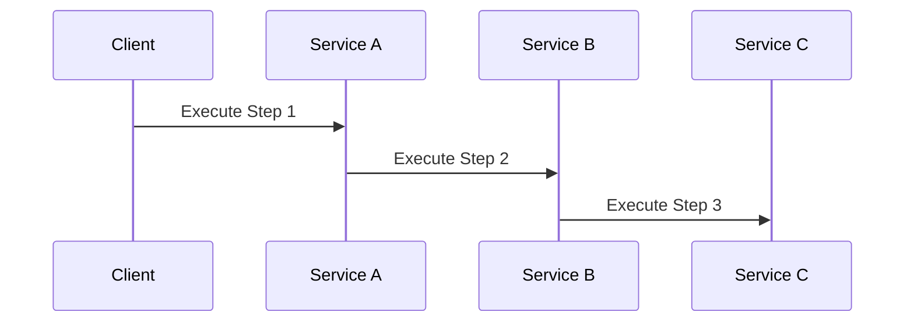
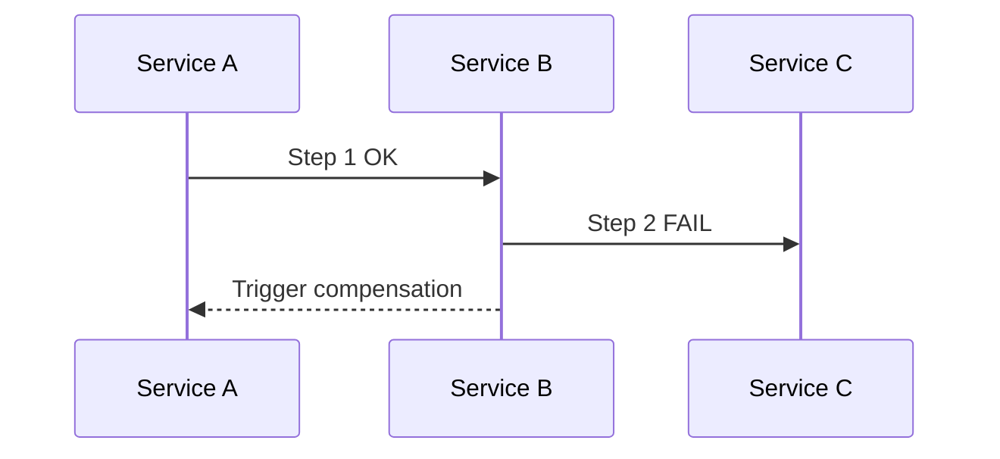
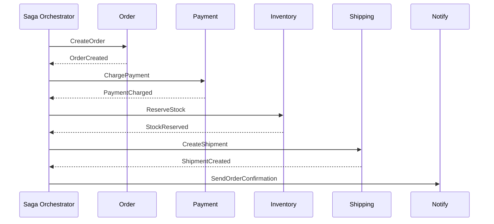
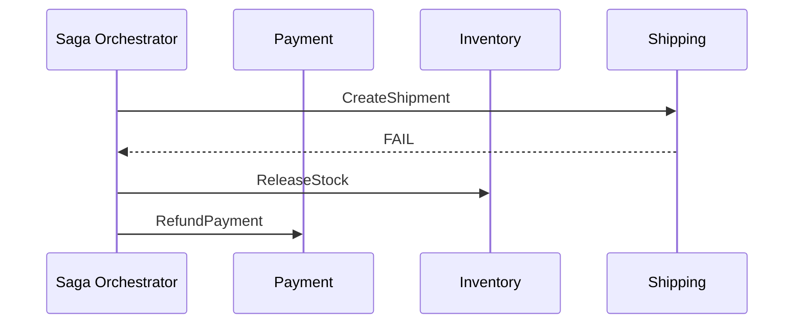
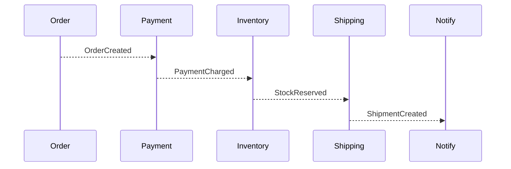
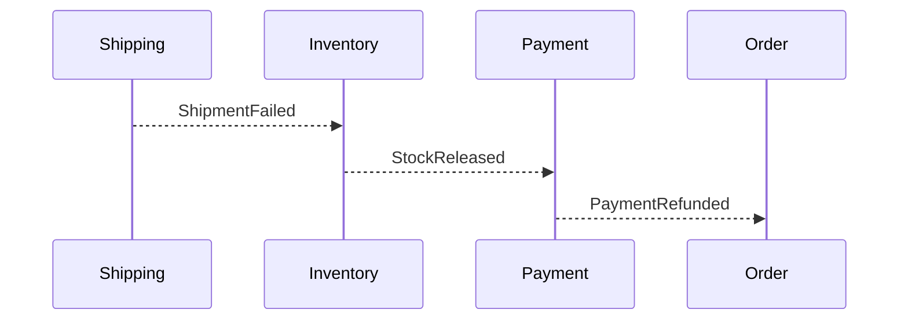

# 🔄 Saga Pattern trong Microservices

## 🎯 Mục tiêu

* Hiểu rõ **Saga Pattern là gì** và vì sao nó tồn tại
* Phân biệt **Saga Orchestration** và **Saga Choreography**
* Nắm các khái niệm cốt lõi khi implement Saga
* Tránh các lỗi phổ biến khi áp dụng Saga trong hệ thống thực tế

---

## 1️⃣ Saga Pattern là gì?

### 1.1 Định nghĩa

**Saga Pattern** là một cách tiếp cận để xử lý **Distributed Transaction** bằng cách:

* Chia một nghiệp vụ lớn thành nhiều **local transaction**
* Mỗi local transaction **commit ngay** vào database của service tương ứng
* Khi có lỗi xảy ra, hệ thống thực hiện **compensating transaction** để hoàn tác nghiệp vụ

> Saga **không sử dụng** distributed ACID transaction.

---

## 2️⃣ Vì sao cần Saga?

Trong kiến trúc microservices:

* Mỗi service sở hữu database riêng
* Không thể dùng transaction bao trùm nhiều database

Nếu không có Saga:

* Dữ liệu dễ rơi vào trạng thái **inconsistent**
* Khó xử lý failure giữa chừng

Saga giải quyết bài toán:

* Nhất quán ở **mức nghiệp vụ** (business consistency)
* Chấp nhận **Eventual Consistency**

---

## 3️⃣ So sánh: Transaction truyền thống vs Saga

| Tiêu chí    | ACID Transaction | Saga              |
| ----------- | ---------------- | ----------------- |
| Phạm vi     | 1 DB             | Nhiều service     |
| Rollback    | DB rollback      | Compensation      |
| Consistency | Strong           | Eventual          |
| Coupling    | Thấp             | Thấp – Trung bình |

---

## 4️⃣ Saga hoạt động như thế nào?

### 4.1 Luồng tổng quát

---

### 4.2 Khi có lỗi xảy ra

---

## 5️⃣ Compensating Transaction là gì?

### Định nghĩa

**Compensating Transaction** là hành động nghiệp vụ **ngược lại** với hành động đã thực hiện trước đó.

Ví dụ:

* Charge tiền → Refund tiền
* Reserve stock → Release stock
* Create order → Cancel order

> ⚠️ Compensation **không đảm bảo** rollback 100% trạng thái ban đầu.

---

## 6️⃣ Hai mô hình Saga

Saga có hai cách triển khai chính: **Orchestration** và **Choreography**.
Sự khác nhau nằm ở **ai là người điều khiển luồng nghiệp vụ**.

---

## 6.1 🧭 Saga Orchestration (Centralized Control)

### 6.1.1 Khái niệm

Saga Orchestration sử dụng một **Saga Orchestrator** (service trung tâm) để:

* Điều phối thứ tự các bước nghiệp vụ
* Gửi command đến các service tham gia
* Theo dõi trạng thái Saga (state machine)
* Kích hoạt **compensating transaction** khi có lỗi

Các service tham gia Saga **chỉ biết xử lý command của riêng mình**, không biết toàn bộ flow.

---

### 6.1.2 Ví dụ thực tế: Đặt hàng E-commerce (nhiều service)

Các service tham gia:

* **Order Service** – tạo & quản lý đơn hàng
* **Payment Service** – trừ / hoàn tiền
* **Inventory Service** – giữ / trả tồn kho
* **Shipping Service** – tạo / hủy vận đơn
* **Notification Service** – gửi email / push

---

### 6.1.3 Happy Path

---

### 6.1.4 Failure & Compensating Transaction (Shipping FAIL)

💡 **Điểm quan trọng**:

* Không có rollback DB
* Mỗi service thực hiện **hành động nghiệp vụ ngược lại**
* Saga Orchestrator quyết định **thứ tự compensation**

---

### 6.1.5 Ưu & Nhược điểm (khi có nhiều service)

**Ưu điểm**

* Flow rõ ràng dù nghiệp vụ rất phức tạp
* Debug & trace dễ
* Phù hợp nghiệp vụ tài chính / đặt hàng

**Nhược điểm**

* Orchestrator dễ phình to
* Phải thiết kế state machine cẩn thận

---

## 6.2 🎶 Saga Choreography (Event-driven)

### 6.2.1 Khái niệm

Saga Choreography **không có service điều phối trung tâm**.

* Mỗi service:

  * Lắng nghe event
  * Phát event mới
  * Tự quyết định compensation của mình

---

### 6.2.2 Ví dụ thực tế: Đặt hàng E-commerce (nhiều service)

Các service giống Orchestration, nhưng giao tiếp bằng event.

---

### 6.2.3 Happy Path

---

### 6.2.4 Failure & Compensating Transaction (Shipping FAIL)

💡 **Điểm quan trọng**:

* Mỗi service chỉ biết **event liên quan đến mình**
* Không ai nhìn thấy toàn bộ flow
* Compensation được kích hoạt **theo chuỗi event ngược**

---

### 6.2.5 Ưu & Nhược điểm (khi có nhiều service)

**Ưu điểm**

* Loose coupling rất cao
* Scale tốt khi nhiều team

**Nhược điểm**

* Flow khó hiểu
* Debug rất khó nếu thiếu tracing
* Dễ tạo vòng lặp event nếu thiết kế kém

---

## 7️⃣ Các khái niệm quan trọng khi implement Saga

### 7.1 Idempotency

* Event có thể được xử lý nhiều lần
* Mỗi service phải xử lý **idempotent**

---

### 7.2 Retry & Timeout

* Network không đáng tin
* Retry có kiểm soát

---

### 7.3 Ordering

* Event có thể đến sai thứ tự
* Cần state machine hoặc version

---

### 7.4 Observability

* Logging
* Distributed tracing
* Correlation ID

---

## 8️⃣ Best Practices

* Thiết kế Saga theo **nghiệp vụ**, không theo kỹ thuật
* Ưu tiên Orchestration khi hệ thống còn nhỏ
* Đảm bảo idempotency cho mọi consumer
* Luôn thiết kế compensation trước
* Chuẩn bị kịch bản failure

---

## 9️⃣ Khi nào không nên dùng Saga?

* Nghiệp vụ đơn giản
* Có thể xử lý async hoặc batch
* Không yêu cầu consistency cao

---

## 🔚 Kết luận

Saga Pattern là giải pháp thực tế nhất cho Distributed Transaction trong Microservices, nhưng đi kèm nhiều trade-off cần hiểu rõ trước khi áp dụng.

---

## 📚 Gợi ý học tiếp

* Saga với Kafka + NestJS
* Order State Machine
* Saga testing strategies
